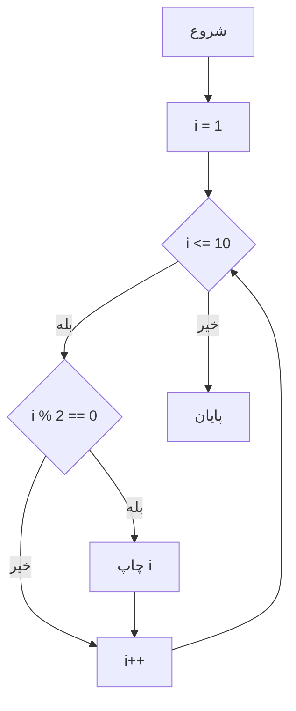
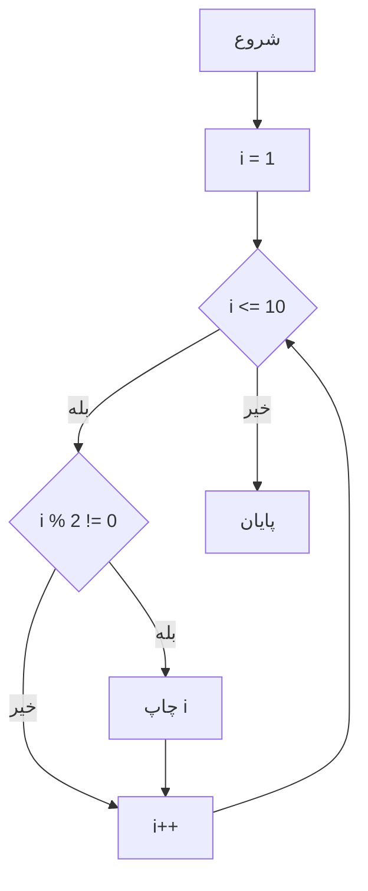
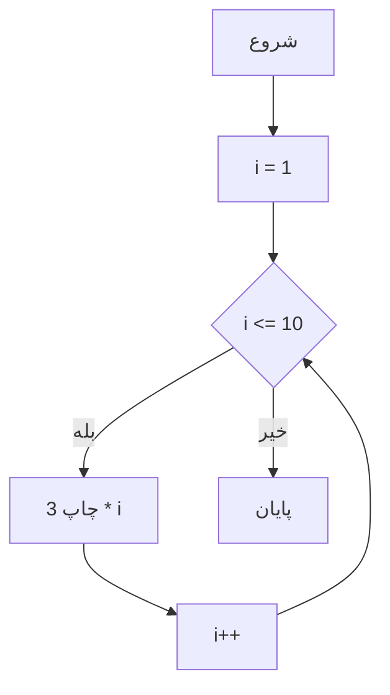
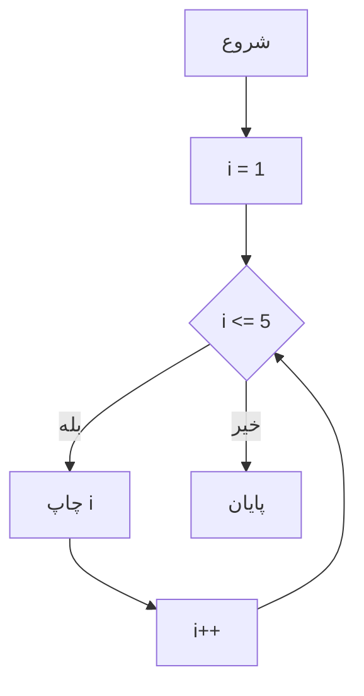
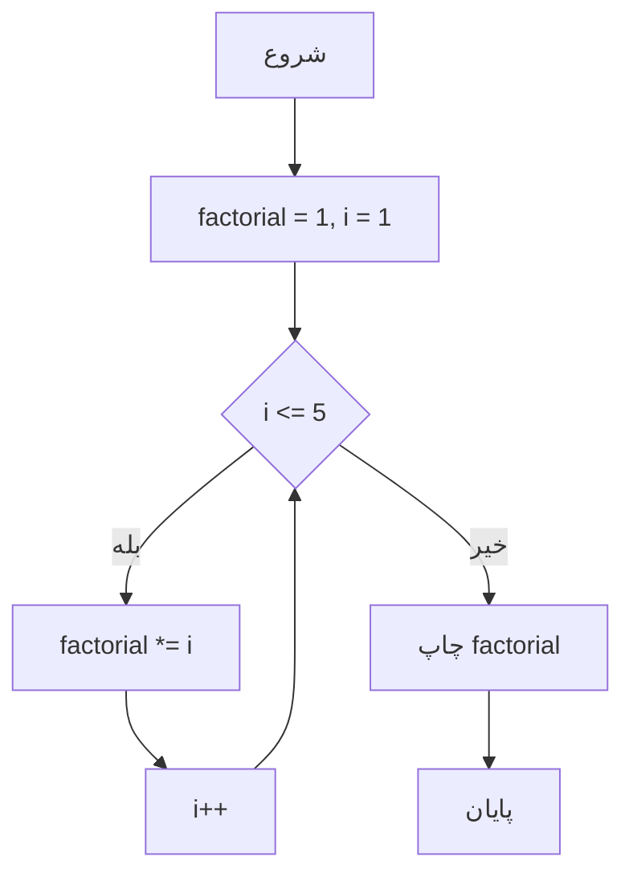
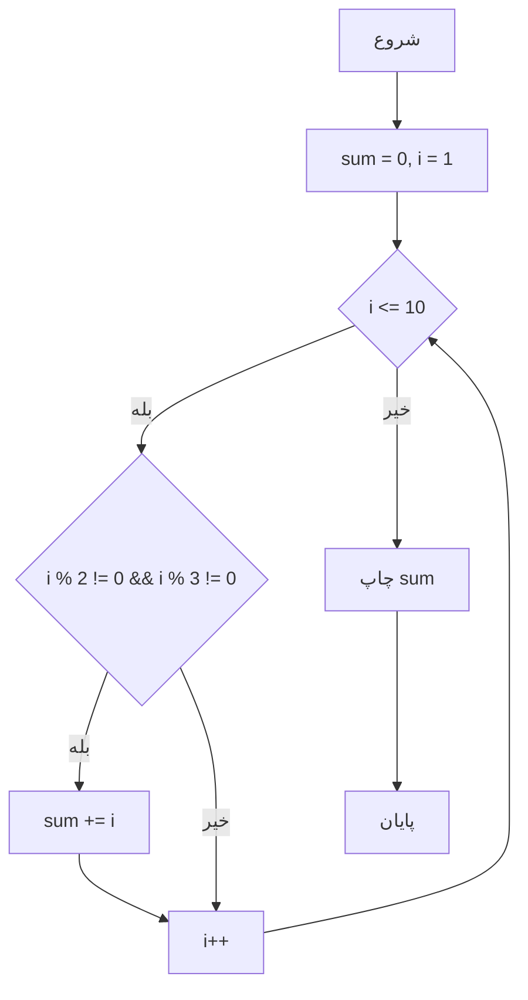
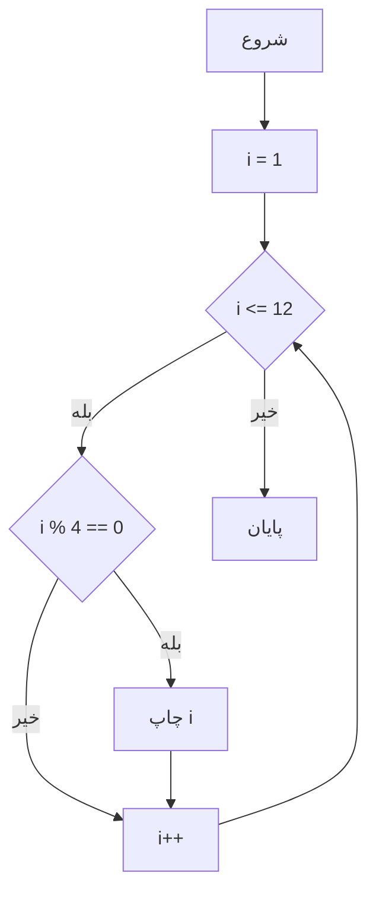

برنامه‌ای بنویس که:
1. با `for` اعداد زوج بین 1 تا 10 رو چاپ کنه.
### سودوکد (Pseudocode)


```
// شروع برنامه

// حلقه for برای چاپ اعداد زوج 1 تا 10
FOR i = 1 TO 10 DO
    IF i % 2 == 0 THEN
        PRINT i
    ENDIF
ENDFOR
```

```php
// 1. حلقه for برای چاپ اعداد زوج 1 تا 10
// 1. For loop to print even numbers from 1 to 10
echo "اعداد زوج 1 تا 10:<br>";
for ($i = 1; $i <= 10; $i++) {
    if ($i % 2 == 0) {
        echo "$i "; // 2 4 6 8 10
    }
}
```

**`for`:**
   - از 1 تا 10 می‌چرخه و با شرط `% 2 == 0` فقط اعداد زوج رو چاپ می‌کنه.
   - خروجی: 2 4 6 8 10.





1. با `for` اعداد فرد بین 1 تا 10 رو چاپ کنه.
2. // حلقه for برای چاپ اعداد فرد 1 تا 10
FOR i = 1 TO 10 DO
    IF i % 2 != 0 THEN
        PRINT i
    ENDIF
ENDFOR

```php
// 1. حلقه for برای چاپ اعداد فرد 1 تا 10
// 1. For loop to print odd numbers from 1 to 10
echo "اعداد فرد 1 تا 10:<br>";
for ($i = 1; $i <= 10; $i++) {
    if ($i % 2 != 0) {
        echo "$i "; // 1 3 5 7 9
    }
}
```

### جدول صحت (Truth Table) برای شرط‌های هر حلقه
#### 1. حلقه `for` (شرط: `$i % 2 != 0`)
| `$i` | `$i % 2` | `$i % 2 != 0` | نتیجه (چاپ می‌شود؟) |
|------|----------|---------------|---------------------|
| 1    | 1        | True          | بله                |
| 2    | 0        | False         | خیر                |
| 3    | 1        | True          | بله                |
| 4    | 0        | False         | خیر                |
| 5    | 1        | True          | بله                |
| ...  | ...      | ...           | ...                |
- **توضیح:** فقط وقتی `$i % 2 != 0` درست باشه (یعنی عدد فرد باشه)، `$i` چاپ می‌شه.


#### 1. فلوچارت `for`


```
   اعداد فرد 1 تا 10:
   1 3 5 7 9
```


برنامه‌ای بنویس که:
1. با `for` جدول ضرب عدد 3 رو تا 10 چاپ کنه.
‍‍‍‍‍‍‍
```
// حلقه for برای جدول ضرب 3
FOR i = 1 TO 10 DO
    PRINT "3 * i = نتیجه"
ENDFOR
```

```php
// 1. حلقه for برای جدول ضرب 3
// 1. For loop to print multiplication table of 3
echo "جدول ضرب 3:<br>";
for ($i = 1; $i <= 10; $i++) {
    $result = 3 * $i;
    echo "3 * $i = $result<br>"; // 3 * 1 = 3, 3 * 2 = 6, ...
}
```


1. **`for`:**
   - از 1 تا 10 می‌چرخه و برای هر `$i`، ضرب 3 رو حساب و چاپ می‌کنه.
   - خروجی جدول ضرب 3 تا 10 می‌شه.




1. با `for` اعداد 1 تا 5 رو چاپ کنه.

```
// حلقه for برای چاپ 1 تا 5
FOR i = 1 TO 5 DO
    PRINT i
ENDFOR
```

```php

// 1. حلقه for برای چاپ اعداد 1 تا 5

// 1. For loop to print numbers 1 to 5
echo "حلقه for:<br>";
for ($i = 1; $i <= 5; $i++) {
    echo "$i "; // 1 2 3 4 5
}

```

1. **`for`:**
   - از 1 تا 5 می‌چرخه و هر عدد رو با فاصله چاپ می‌کنه.
   - `$i++` متغیر رو در هر چرخه یکی زیاد می‌کنه.

#### 1. فلوچارت `for`



1. **با `for` فاکتوریل عدد 5 رو حساب کنه (5! = 5 × 4 × 3 × 2 × 1).**

```
// حلقه for برای محاسبه فاکتوریل 5
SET factorial = 1
FOR i = 1 TO 5 DO
    MULTIPLY factorial by i
ENDFOR
PRINT "فاکتوریل 5: factorial"
```


```PHP
// 1. حلقه for برای محاسبه فاکتوریل 5
// 1. For loop to calculate factorial of 5
echo "محاسبه فاکتوریل 5:<br>";
$factorial = 1;
for ($i = 1; $i <= 5; $i++) {
    $factorial *= $i; // ضرب i در فاکتوریل
}
echo "فاکتوریل 5: $factorial<br><br>"; // Factorial of 5: 120
```


1. **`for`:**
   - از 1 تا 5 می‌چرخه و هر بار `$i` رو در `$factorial` ضرب می‌کنه.
   - نتیجه فاکتوریل 5 (120) می‌شه.


#### 1. فلوچارت `for`



1. با `for` مجموع اعداد 1 تا 10 رو حساب کنه، ولی فقط اعدادی که بر 2 یا 3 بخش‌پذیر نیستن رو جمع کنه.


```
// حلقه for برای جمع اعداد خاص
SET sum = 0
FOR i = 1 TO 10 DO
    IF i % 2 != 0 AND i % 3 != 0 THEN
        ADD i to sum
    ENDIF
ENDFOR
PRINT "جمع: sum"
```

```php
// 1. حلقه for برای جمع اعداد خاص
// 1. For loop to sum numbers not divisible by 2 or 3
echo "جمع اعداد خاص (1 تا 10):<br>";
$sum = 0;
for ($i = 1; $i <= 10; $i++) {
    if ($i % 2 != 0 && $i % 3 != 0) {
        $sum += $i; // اضافه کردن اعداد خاص
    }
}
echo "جمع: $sum<br><br>"; // Sum: 1 + 5 + 7 = 13

```

#### 1. حلقه `for` (شرط: `$i % 2 != 0 && $i % 3 != 0`)
| `$i` | `$i % 2 != 0` | `$i % 3 != 0` | `$i % 2 != 0 && $i % 3 != 0` | نتیجه (اضافه می‌شود؟) |
|------|---------------|---------------|-----------------------------|-----------------------|
| 1    | True          | True          | True                        | بله                  |
| 2    | False         | True          | False                       | خیر                  |
| 3    | True          | False         | False                       | خیر                  |
| 4    | False         | True          | False                       | خیر                  |
| 5    | True          | True          | True                        | بله                  |
| 6    | False         | False         | False                       | خیر                  |
| 7    | True          | True          | True                        | بله                  |
| ...  | ...           | ...           | ...                         | ...                  |
- **توضیح:** فقط اعدادی که نه بر 2 و نه بر 3 بخش‌پذیر باشن (1, 5, 7) جمع می‌شن.

#### 1. فلوچارت `for`

1. با `for` اعداد بین 1 تا 12 رو که بر 4 بخش‌پذیرن چاپ کنه.


```
// حلقه for برای اعداد قابل‌تقسیم بر 4
FOR i = 1 TO 12 DO
    IF i % 4 == 0 THEN
        PRINT i
    ENDIF
ENDFOR
```

```php
// 1. حلقه for برای اعداد قابل‌تقسیم بر 4
// 1. For loop to print numbers divisible by 4 from 1 to 12
echo "اعداد قابل‌تقسیم بر 4 (1 تا 12):<br>";
for ($i = 1; $i <= 12; $i++) {
    if ($i % 4 == 0) {
        echo "$i "; // 4 8 12
    }
}
```

#### 1. حلقه `for` (شرط: `$i % 4 == 0`)
| `$i` | `$i % 4` | `$i % 4 == 0` | نتیجه (چاپ می‌شود؟) |
|------|----------|---------------|---------------------|
| 1    | 1        | False         | خیر                |
| 2    | 2        | False         | خیر                |
| 3    | 3        | False         | خیر                |
| 4    | 0        | True          | بله                |
| 5    | 1        | False         | خیر                |
| ...  | ...      | ...           | ...                |
| 12   | 0        | True          | بله                |
- **توضیح:** فقط وقتی `$i % 4 == 0` درست باشه (یعنی بر 4 بخش‌پذیر باشه)، `$i` چاپ می‌شه.
#### 1. فلوچارت `for`


1. با `for` اعداد بین 1 تا 20 رو که بر 5 بخش‌پذیرن چاپ کنه.
```Pseudocode
// حلقه for برای اعداد قابل‌تقسیم بر 5
FOR i = 1 TO 20 DO
    IF i % 5 == 0 THEN
        PRINT i
    ENDIF
ENDFOR
``

```


```php
// 1. حلقه for برای اعداد قابل‌تقسیم بر 5
// 1. For loop to print numbers divisible by 5 from 1 to 20
echo "اعداد قابل‌تقسیم بر 5 (1 تا 20):<br>";
for ($i = 1; $i <= 20; $i++) {
    if ($i % 5 == 0) {
        echo "$i "; // 5 10 15 20
    }
}
```

#### 1. حلقه `for` (شرط: `$i % 5 == 0`)
| `$i` | `$i % 5` | `$i % 5 == 0` | نتیجه (چاپ می‌شود؟) |
|------|----------|---------------|---------------------|
| 1    | 1        | False         | خیر                |
| 2    | 2        | False         | خیر                |
| 3    | 3        | False         | خیر                |
| 4    | 4        | False         | خیر                |
| 5    | 0        | True          | بله                |
| ...  | ...      | ...           | ...                |
| 20   | 0        | True          | بله                |
- **توضیح:** فقط وقتی `$i % 5 == 0` درست باشه (یعنی بر 5 بخش‌پذیر باشه)، `$i` چاپ می‌شه.

#### 1. فلوچارت `for`

