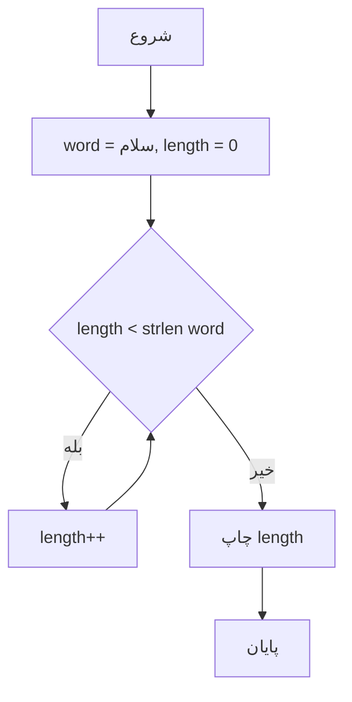
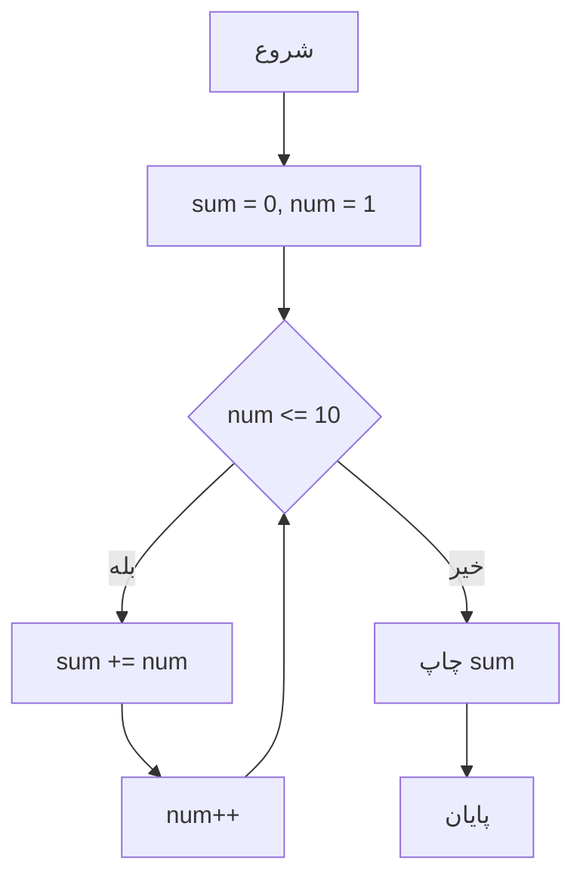

1. با `while` تعداد حروف یه کلمه رو بشماره.

```
// حلقه while برای شمارش حروف کلمه
SET word = "سلام"
SET length = 0
WHILE length < طول word DO
    INCREMENT length
ENDWHILE
PRINT "تعداد حروف: length"

```




```php
// 2. حلقه while برای شمارش حروف کلمه
// 2. While loop to count characters in a word
echo "شمارش حروف:<br>";
$word = "سلام";
$length = 0;
while ($length < strlen($word)) {
    $length++; // افزایش طول
}
echo "تعداد حروف '$word': $length<br><br>"; // Number of characters in 'سلام': 5
```


2. **`while`:**
   - طول کلمه "سلام" رو با `strlen()` می‌گیره و با `$length++` تعداد حروف رو می‌شماره.
   - خروجی تعداد حروف (5) رو نشون می‌ده.


---

2. با `while` جمع اعداد 1 تا 10 رو حساب کنه و نشون بده.

```
// حلقه while برای جمع اعداد 1 تا 10
SET sum = 0
SET num = 1
WHILE num <= 10 DO
    ADD num to sum
    INCREMENT num
ENDWHILE
PRINT sum
```


#### 2. فلوچارت `while`



```php
// 2. حلقه while برای جمع اعداد 1 تا 10
// 2. While loop to sum numbers 1 to 10
echo "جمع اعداد 1 تا 10:<br>";
$sum = 0;
$num = 1;
while ($num <= 10) {
    $sum += $num; // اضافه کردن num به sum
    $num++;       // افزایش num
}
echo "جمع = $sum<br><br>"; // Sum = 55
```


2. **`while`:**
   - متغیر `$sum` رو با اعداد 1 تا 10 جمع می‌کنه.
   - `$num++` در هر چرخه یکی به `$num` اضافه می‌کنه تا شرط پایان (`<= 10`) برقرار باشه.

---

