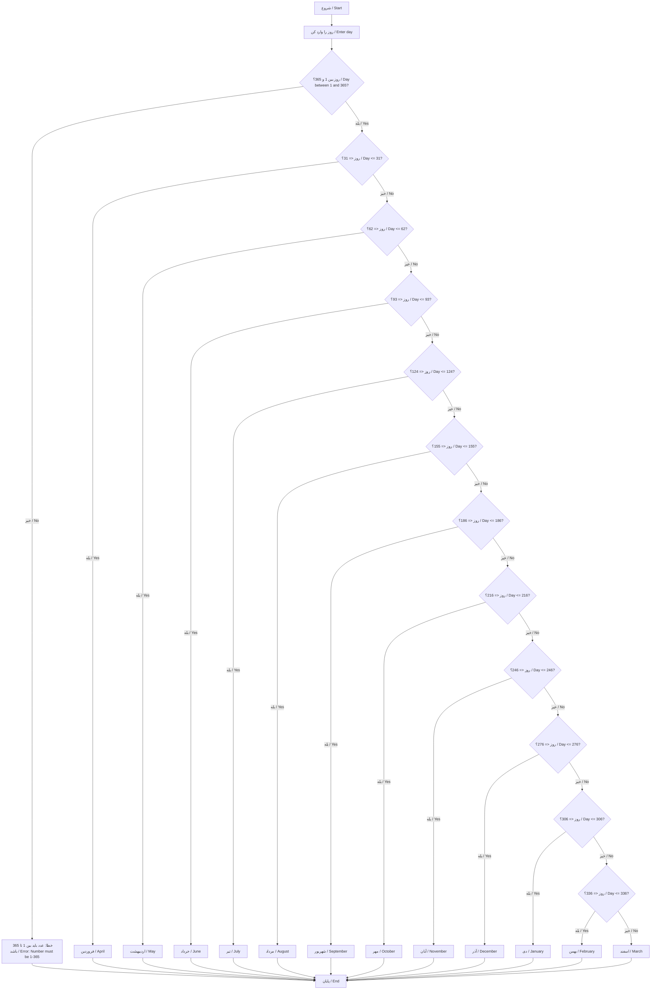
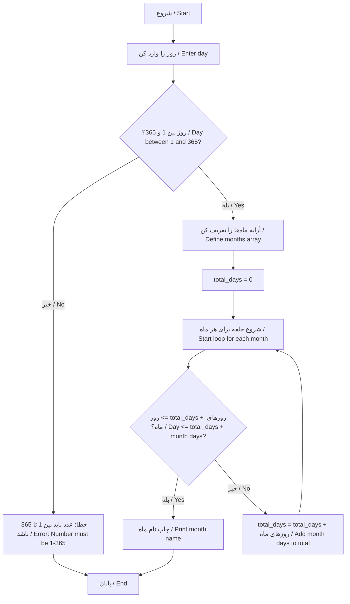
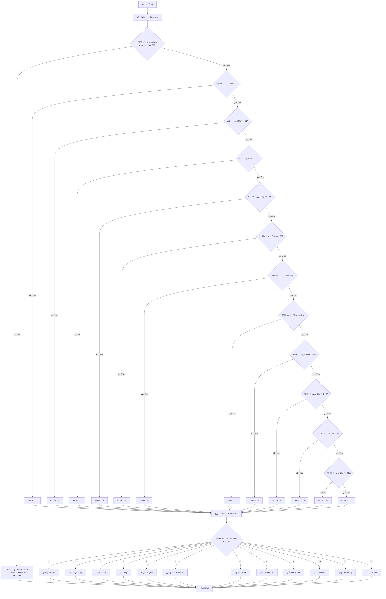
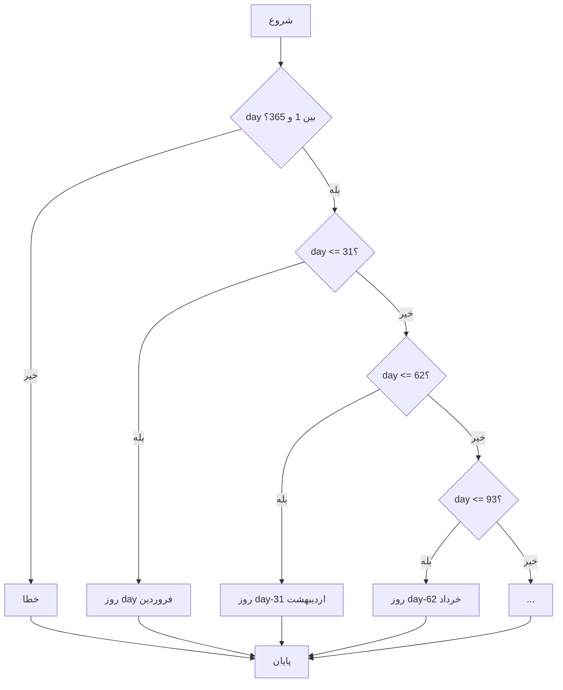
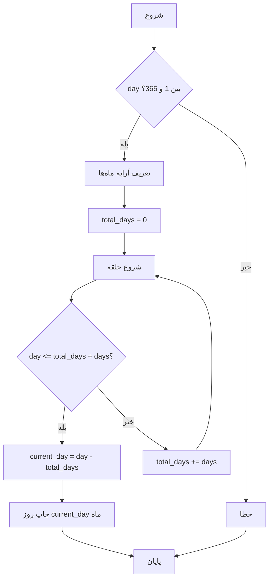
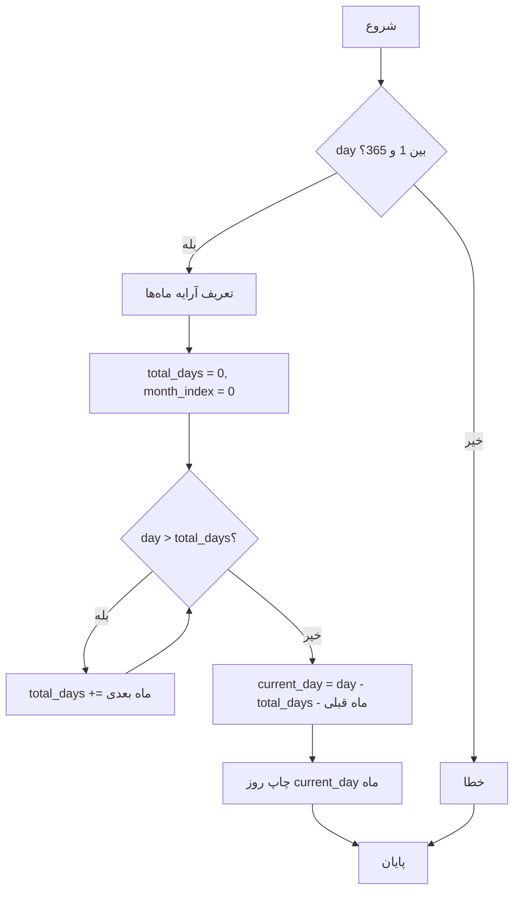
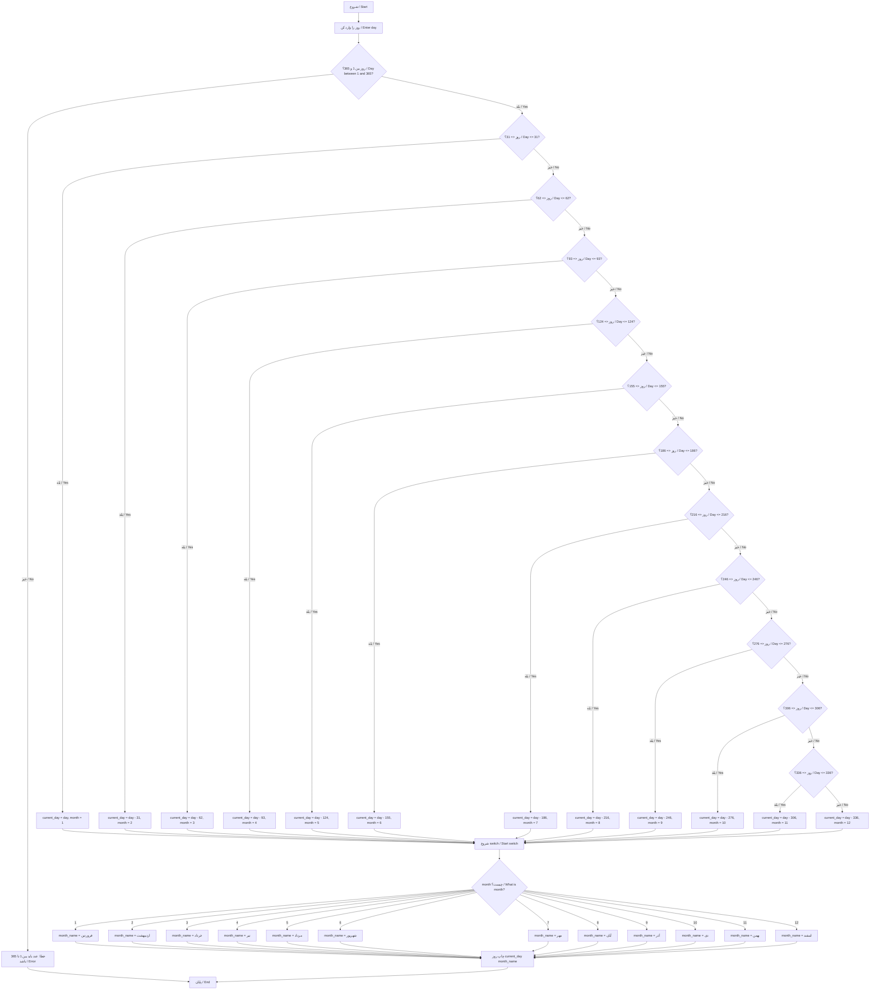

‫برنامه ‫ای ‬‫بنویسید‬ ‫که‬ ‫یک‬ ‫عدد‬ ‫از‬ ‫‪1‬‬ ‫تا‬ ۳۶۵را‬ ‫گرفته‬ ‫و‬ ‫ماه‬ ‫جاری‬ ‫را‬ ‫چاپ‬ ‫کند‪.‬‬

برای این تمرین، یه برنامه می‌نویسم که یه عدد بین 1 تا 365 (تعداد روزهای سال) رو بگیره و ماه متناظر با اون روز رو چاپ کنه. فرض می‌کنیم سال غیرکبیسه‌ست (365 روز) و تعداد روزهای هر ماه به ترتیب تقویم شمسی محاسبه می‌شه:  
- 6 ماه اول: 31 روز  
- 5 ماه بعد: 30 روز  
- ماه آخر (اسفند): 29 روز  

با استفاده از شرط‌ها، می‌تونیم بازه‌ی روزهای هر ماه رو مشخص کنیم.

---

### 1. سودوکد (Pseudo-code)
```
START
    SET day = 100
    IF day < 1 OR day > 365 THEN
        PRINT "عدد باید بین 1 تا 365 باشد"
    ELSE IF day <= 31 THEN
        PRINT "فروردین"
    ELSE IF day <= 62 THEN
        PRINT "اردیبهشت"
    ELSE IF day <= 93 THEN
        PRINT "خرداد"
    ELSE IF day <= 124 THEN
        PRINT "تیر"
    ELSE IF day <= 155 THEN
        PRINT "مرداد"
    ELSE IF day <= 186 THEN
        PRINT "شهریور"
    ELSE IF day <= 216 THEN
        PRINT "مهر"
    ELSE IF day <= 246 THEN
        PRINT "آبان"
    ELSE IF day <= 276 THEN
        PRINT "آذر"
    ELSE IF day <= 306 THEN
        PRINT "دی"
    ELSE IF day <= 336 THEN
        PRINT "بهمن"
    ELSE
        PRINT "اسفند"
    END IF
END
```

---

### 2. کد PHP
```php
<?php
$day = 100; // عدد رو اینجا بین 1 تا 365 تغییر بده
// $day = 100; // Change the number here between 1 and 365

// بررسی اینکه عدد در محدوده مجاز هست یا نه
// Checking if the number is in the valid range
if ($day < 1 || $day > 365) {
    echo "عدد باید بین 1 تا 365 باشد"; // Number must be between 1 and 365
} else {
    // تعیین ماه بر اساس روز سال
    // Determining the month based on the day of the year
    if ($day <= 31) {
        echo "فروردین"; // April
    } elseif ($day <= 62) {
        echo "اردیبهشت"; // May
    } elseif ($day <= 93) {
        echo "خرداد"; // June
    } elseif ($day <= 124) {
        echo "تیر"; // July
    } elseif ($day <= 155) {
        echo "مرداد"; // August
    } elseif ($day <= 186) {
        echo "شهریور"; // September
    } elseif ($day <= 216) {
        echo "مهر"; // October
    } elseif ($day <= 246) {
        echo "آبان"; // November
    } elseif ($day <= 276) {
        echo "آذر"; // December
    } elseif ($day <= 306) {
        echo "دی"; // January
    } elseif ($day <= 336) {
        echo "بهمن"; // February
    } else {
        echo "اسفند"; // March
    }
}
?>
```

---

### 3. کد برای فلوچارت (با فرمت Mermaid)
این کد رو می‌تونی تو [Mermaid Live Editor](https://mermaid.live/) بذاری:


---

### تست برنامه
- `$day = 1` → **فروردین**
- `$day = 32` → **اردیبهشت** (چون 32 > 31)
- `$day = 186` → **شهریور**
- `$day = 337` → **اسفند**
- `$day = 366` → **عدد باید بین 1 تا 365 باشد**

---

**روش جدید (آرایه و حلقه)**

---

### توضیح منطق جدید
- یه آرایه تعریف می‌کنیم که اسم ماه‌ها و تعداد روزهای هر ماه رو نگه داره.
- با یه حلقه یا محاسبه ساده، روز ورودی رو با مجموع روزهای ماه‌ها مقایسه می‌کنیم تا ببینیم تو کدوم ماه قرار می‌گیره.
- این روش انعطاف‌پذیرتره و اگه بعداً بخوای تعداد روزها رو تغییر بدی (مثلاً برای سال کبیسه)، راحت‌تره.

---

### 1. سودوکد (Pseudo-code)
```
START
    SET day = 100
    IF day < 1 OR day > 365 THEN
        PRINT "عدد باید بین 1 تا 365 باشد"
    ELSE
        SET months = ["فروردین":31, "اردیبهشت":31, "خرداد":31, "تیر":31, "مرداد":31, "شهریور":31, 
                      "مهر":30, "آبان":30, "آذر":30, "دی":30, "بهمن":30, "اسفند":29]
        SET total_days = 0
        FOR each month in months
            IF day <= total_days + month.days THEN
                PRINT month.name
                BREAK
            ELSE
                total_days = total_days + month.days
            END IF
        END FOR
    END IF
END
```

---

### 2. کد PHP
```php
<?php
$day = 100; // عدد رو اینجا بین 1 تا 365 تغییر بده
// $day = 100; // Change the number here between 1 and 365

// بررسی محدوده مجاز
// Checking if the number is in the valid range
if ($day < 1 || $day > 365) {
    echo "عدد باید بین 1 تا 365 باشد"; // Number must be between 1 and 365
} else {
    // تعریف آرایه ماه‌ها با تعداد روزهای هر ماه
    // Defining an array of months with their days
    $months = [
        "فروردین" => 31,
        "اردیبهشت" => 31,
        "خرداد" => 31,
        "تیر" => 31,
        "مرداد" => 31,
        "شهریور" => 31,
        "مهر" => 30,
        "آبان" => 30,
        "آذر" => 30,
        "دی" => 30,
        "بهمن" => 30,
        "اسفند" => 29
    ];

    $total_days = 0; // مجموع روزهای گذشته
    // $total_days = 0; // Sum of days passed

    // حلقه برای پیدا کردن ماه
    // Loop to find the month
    foreach ($months as $month_name => $days) {
        if ($day <= $total_days + $days) {
            echo $month_name; // چاپ نام ماه
            break; // خروج از حلقه وقتی ماه پیدا شد
        }
        $total_days += $days; // اضافه کردن روزهای ماه به مجموع
    }
}
?>
```

---

### 3. کد برای فلوچارت (با فرمت Mermaid)
این فلوچارت یه کم پیچیده‌تره چون حلقه داره:


---

### تست برنامه
- `$day = 1` → **فروردین**
- `$day = 32` → **اردیبهشت** (چون 32 > 31)
- `$day = 186` → **شهریور**
- `$day = 337` → **اسفند**
- `$day = 366` → **عدد باید بین 1 تا 365 باشد**

---

### مقایسه با روش قبلی
- **روش قبلی (if-elseif):** ساده‌تر برای درک اولیه، ولی کد طولانی‌تره و تغییر دادنش سخت‌تره.
- **روش جدید (آرایه و حلقه):** کد کوتاه‌تر و قابل‌انعطاف‌تره، ولی ممکنه برای مبتدی‌ها کمی پیچیده‌تر به نظر بیاد.

---

باشه! حالا این مسئله رو با استفاده از `switch` حل می‌کنیم. چون تعداد روزها (1 تا 365) خیلی زیاده و نمی‌شه برای هر روز یه `case` جدا نوشت، یه راه هوشمندانه‌تر پیدا می‌کنیم:  
- اول روز رو به بازه‌های ماه‌ها نگاشت می‌کنیم (مثل روش `if-elseif`) و بعد از `switch` برای انتخاب نام ماه استفاده می‌کنیم.
- برای این کار، شماره ماه رو محاسبه می‌کنیم و بعد با `switch` اسم ماه رو چاپ می‌کنیم.

---

### توضیح منطق
- روزهای سال رو به 12 بازه تقسیم می‌کنیم (مثل قبل: 31 روز برای 6 ماه اول، 30 روز برای 5 ماه بعدی، 29 روز برای اسفند).
- با شرط‌ها شماره ماه رو پیدا می‌کنیم (1 تا 12).
- از `switch` برای تبدیل شماره ماه به اسم ماه استفاده می‌کنیم.

---

### 1. سودوکد (Pseudo-code)
```
START
    SET day = 100
    IF day < 1 OR day > 365 THEN
        PRINT "عدد باید بین 1 تا 365 باشد"
    ELSE
        IF day <= 31 THEN SET month = 1
        ELSE IF day <= 62 THEN SET month = 2
        ELSE IF day <= 93 THEN SET month = 3
        ELSE IF day <= 124 THEN SET month = 4
        ELSE IF day <= 155 THEN SET month = 5
        ELSE IF day <= 186 THEN SET month = 6
        ELSE IF day <= 216 THEN SET month = 7
        ELSE IF day <= 246 THEN SET month = 8
        ELSE IF day <= 276 THEN SET month = 9
        ELSE IF day <= 306 THEN SET month = 10
        ELSE IF day <= 336 THEN SET month = 11
        ELSE SET month = 12
        END IF
        
        SWITCH month
            CASE 1: PRINT "فروردین"
            CASE 2: PRINT "اردیبهشت"
            CASE 3: PRINT "خرداد"
            CASE 4: PRINT "تیر"
            CASE 5: PRINT "مرداد"
            CASE 6: PRINT "شهریور"
            CASE 7: PRINT "مهر"
            CASE 8: PRINT "آبان"
            CASE 9: PRINT "آذر"
            CASE 10: PRINT "دی"
            CASE 11: PRINT "بهمن"
            CASE 12: PRINT "اسفند"
            DEFAULT: PRINT "خطا"
        END SWITCH
    END IF
END
```

---

### 2. کد PHP
```php
<?php
$day = 100; // عدد رو اینجا بین 1 تا 365 تغییر بده
// $day = 100; // Change the number here between 1 and 365

// بررسی محدوده مجاز
// Checking if the number is in the valid range
if ($day < 1 || $day > 365) {
    echo "عدد باید بین 1 تا 365 باشد"; // Number must be between 1 and 365
} else {
    // محاسبه شماره ماه بر اساس روز
    // Calculating the month number based on the day
    if ($day <= 31) {
        $month = 1;
    } elseif ($day <= 62) {
        $month = 2;
    } elseif ($day <= 93) {
        $month = 3;
    } elseif ($day <= 124) {
        $month = 4;
    } elseif ($day <= 155) {
        $month = 5;
    } elseif ($day <= 186) {
        $month = 6;
    } elseif ($day <= 216) {
        $month = 7;
    } elseif ($day <= 246) {
        $month = 8;
    } elseif ($day <= 276) {
        $month = 9;
    } elseif ($day <= 306) {
        $month = 10;
    } elseif ($day <= 336) {
        $month = 11;
    } else {
        $month = 12;
    }

    // انتخاب نام ماه با switch
    // Selecting the month name with switch
    switch ($month) {
        case 1:
            echo "فروردین"; // April
            break;
        case 2:
            echo "اردیبهشت"; // May
            break;
        case 3:
            echo "خرداد"; // June
            break;
        case 4:
            echo "تیر"; // July
            break;
        case 5:
            echo "مرداد"; // August
            break;
        case 6:
            echo "شهریور"; // September
            break;
        case 7:
            echo "مهر"; // October
            break;
        case 8:
            echo "آبان"; // November
            break;
        case 9:
            echo "آذر"; // December
            break;
        case 10:
            echo "دی"; // January
            break;
        case 11:
            echo "بهمن"; // February
            break;
        case 12:
            echo "اسفند"; // March
            break;
        default:
            echo "خطا"; // Error
            break;
    }
}
?>
```

---

### 3. کد برای فلوچارت (با فرمت Mermaid)


---

### تست برنامه
- `$day = 1` → **فروردین**
- `$day = 32` → **اردیبهشت**
- `$day = 186` → **شهریور**
- `$day = 337` → **اسفند**
- `$day = 366` → **عدد باید بین 1 تا 365 باشد**

---

### مقایسه با روش‌های قبلی
- **روش `if-elseif`:** همه‌چیز تو شرط‌ها بود، ساده ولی طولانی.
- **روش آرایه و حلقه:** کوتاه و انعطاف‌پذیر، ولی حلقه داشت.
- **روش `switch`:** اینجا شرط‌ها و `switch` رو ترکیب کردیم؛ خوانایی خوبی داره ولی هنوز یه بخش محاسباتی قبل از `switch` لازمه.

---

‫برنامه‬‫ای‬‫بنویسید‬ ‫که‬ ‫یک‬ ‫عدد‬ ‫از‬ ‫‪1‬‬ ‫تا‬ ‫‪۳۶۵‬‬ ‫را‬ ‫گرفته‬ ‫و‬ ‫روز‬ ‫جاری‬ ‫ماه‬ ‫را‬ ‫چاپ‬ ‫کند‪.‬‬

برای این تمرین، باید برنامه‌ای بنویسیم که یه عدد بین 1 تا 365 بگیره و **روز جاری ماه** رو چاپ کنه (یعنی مثلاً اگه عدد 32 باشه، بگه روز 1 اردیبهشت). این با تمرین قبلی فرق داره چون حالا باید روز دقیق ماه رو محاسبه کنیم، نه فقط اسم ماه. من این رو با چند روش حل می‌کنم:  
1. **روش if-elseif**  
2. **روش آرایه و حلقه**  
3. **روش آرایه و محاسبه ریاضی**  

فرض می‌کنیم سال غیرکبیسه‌ست (365 روز) و تعداد روزهای ماه‌ها به ترتیب تقویم شمسیه: 6 ماه اول 31 روز، 5 ماه بعدی 30 روز، اسفند 29 روز.

---

### روش 1: استفاده از `if-elseif`
#### توضیح
- روز رو با بازه‌های ماه‌ها مقایسه می‌کنیم.
- با کم کردن روزهای ماه‌های قبلی، روز جاری رو پیدا می‌کنیم.

#### 1. سودوکد
```
START
    SET day = 100
    IF day < 1 OR day > 365 THEN
        PRINT "عدد باید بین 1 تا 365 باشد"
    ELSE
        IF day <= 31 THEN
            SET current_day = day
            PRINT "روز " + current_day + " فروردین"
        ELSE IF day <= 62 THEN
            SET current_day = day - 31
            PRINT "روز " + current_day + " اردیبهشت"
        ELSE IF day <= 93 THEN
            SET current_day = day - 62
            PRINT "روز " + current_day + " خرداد"
        ELSE IF day <= 124 THEN
            SET current_day = day - 93
            PRINT "روز " + current_day + " تیر"
        ELSE IF day <= 155 THEN
            SET current_day = day - 124
            PRINT "روز " + current_day + " مرداد"
        ELSE IF day <= 186 THEN
            SET current_day = day - 155
            PRINT "روز " + current_day + " شهریور"
        ELSE IF day <= 216 THEN
            SET current_day = day - 186
            PRINT "روز " + current_day + " مهر"
        ELSE IF day <= 246 THEN
            SET current_day = day - 216
            PRINT "روز " + current_day + " آبان"
        ELSE IF day <= 276 THEN
            SET current_day = day - 246
            PRINT "روز " + current_day + " آذر"
        ELSE IF day <= 306 THEN
            SET current_day = day - 276
            PRINT "روز " + current_day + " دی"
        ELSE IF day <= 336 THEN
            SET current_day = day - 306
            PRINT "روز " + current_day + " بهمن"
        ELSE
            SET current_day = day - 336
            PRINT "روز " + current_day + " اسفند"
        END IF
    END IF
END
```

#### 2. کد PHP
```php
<?php
$day = 100; // عدد رو اینجا تغییر بده
// $day = 100; // Change the number here

if ($day < 1 || $day > 365) {
    echo "عدد باید بین 1 تا 365 باشد"; // Number must be between 1 and 365
} else {
    if ($day <= 31) {
        $current_day = $day;
        echo "روز $current_day فروردین"; // Day X April
    } elseif ($day <= 62) {
        $current_day = $day - 31;
        echo "روز $current_day اردیبهشت"; // Day X May
    } elseif ($day <= 93) {
        $current_day = $day - 62;
        echo "روز $current_day خرداد"; // Day X June
    } elseif ($day <= 124) {
        $current_day = $day - 93;
        echo "روز $current_day تیر"; // Day X July
    } elseif ($day <= 155) {
        $current_day = $day - 124;
        echo "روز $current_day مرداد"; // Day X August
    } elseif ($day <= 186) {
        $current_day = $day - 155;
        echo "روز $current_day شهریور"; // Day X September
    } elseif ($day <= 216) {
        $current_day = $day - 186;
        echo "روز $current_day مهر"; // Day X October
    } elseif ($day <= 246) {
        $current_day = $day - 216;
        echo "روز $current_day آبان"; // Day X November
    } elseif ($day <= 276) {
        $current_day = $day - 246;
        echo "روز $current_day آذر"; // Day X December
    } elseif ($day <= 306) {
        $current_day = $day - 276;
        echo "روز $current_day دی"; // Day X January
    } elseif ($day <= 336) {
        $current_day = $day - 306;
        echo "روز $current_day بهمن"; // Day X February
    } else {
        $current_day = $day - 336;
        echo "روز $current_day اسفند"; // Day X March
    }
}
?>
```

#### 3. فلوچارت (Mermaid)
به دلیل طولانی بودن، فقط بخش اصلی رو نشون می‌دم:


---

### روش 2: استفاده از آرایه و حلقه
#### توضیح
- آرایه‌ای از ماه‌ها و تعداد روزهاشون تعریف می‌کنیم.
- با حلقه، روزهای ماه‌های قبلی رو کم می‌کنیم تا روز جاری رو پیدا کنیم.

#### 1. سودوکد
```
START
    SET day = 100
    IF day < 1 OR day > 365 THEN
        PRINT "عدد باید بین 1 تا 365 باشد"
    ELSE
        SET months = ["فروردین":31, "اردیبهشت":31, "خرداد":31, "تیر":31, "مرداد":31, "شهریور":31, 
                      "مهر":30, "آبان":30, "آذر":30, "دی":30, "بهمن":30, "اسفند":29]
        SET total_days = 0
        FOR each month in months
            IF day <= total_days + month.days THEN
                SET current_day = day - total_days
                PRINT "روز " + current_day + " " + month.name
                BREAK
            ELSE
                total_days = total_days + month.days
            END IF
        END FOR
    END IF
END
```

#### 2. کد PHP
```php
<?php
$day = 100; // عدد رو اینجا تغییر بده
// $day = 100; // Change the number here

if ($day < 1 || $day > 365) {
    echo "عدد باید بین 1 تا 365 باشد"; // Number must be between 1 and 365
} else {
    $months = [
        "فروردین" => 31,
        "اردیبهشت" => 31,
        "خرداد" => 31,
        "تیر" => 31,
        "مرداد" => 31,
        "شهریور" => 31,
        "مهر" => 30,
        "آبان" => 30,
        "آذر" => 30,
        "دی" => 30,
        "بهمن" => 30,
        "اسفند" => 29
    ];

    $total_days = 0;
    foreach ($months as $month_name => $days) {
        if ($day <= $total_days + $days) {
            $current_day = $day - $total_days;
            echo "روز $current_day $month_name"; // Day X Month
            break;
        }
        $total_days += $days;
    }
}
?>
```

#### 3. فلوچارت (Mermaid)


---

### روش 3: استفاده از آرایه و محاسبه ریاضی
#### توضیح
- از آرایه استفاده می‌کنیم ولی به جای حلقه، با تقسیم و باقیمانده، ماه و روز رو مستقیم محاسبه می‌کنیم.

#### 1. سودوکد
```
START
    SET day = 100
    IF day < 1 OR day > 365 THEN
        PRINT "عدد باید بین 1 تا 365 باشد"
    ELSE
        SET months = ["فروردین":31, "اردیبهشت":31, "خرداد":31, "تیر":31, "مرداد":31, "شهریور":31, 
                      "مهر":30, "آبان":30, "آذر":30, "دی":30, "بهمن":30, "اسفند":29]
        SET total_days = 0
        SET month_index = 0
        WHILE day > total_days
            SET month_index = month_index + 1
            SET total_days = total_days + months[month_index].days
        END WHILE
        SET current_day = day - (total_days - months[month_index].days)
        PRINT "روز " + current_day + " " + months[month_index].name
    END IF
END
```

#### 2. کد PHP
```php
<?php
$day = 100; // عدد رو اینجا تغییر بده
// $day = 100; // Change the number here

if ($day < 1 || $day > 365) {
    echo "عدد باید بین 1 تا 365 باشد"; // Number must be between 1 and 365
} else {
    $months = [
        "فروردین" => 31,
        "اردیبهشت" => 31,
        "خرداد" => 31,
        "تیر" => 31,
        "مرداد" => 31,
        "شهریور" => 31,
        "مهر" => 30,
        "آبان" => 30,
        "آذر" => 30,
        "دی" => 30,
        "بهمن" => 30,
        "اسفند" => 29
    ];

    $total_days = 0;
    $month_index = 0;
    $month_names = array_keys($months);

    while ($day > $total_days) {
        $total_days += $months[$month_names[$month_index]];
        $month_index++;
    }
    $month_index--; // برگشت به ماه درست
    $current_day = $day - ($total_days - $months[$month_names[$month_index]]);
    echo "روز $current_day $month_names[$month_index]"; // Day X Month
}
?>
```

#### 3. فلوچارت (Mermaid)


---

### تست همه روش‌ها
- `$day = 1` → **روز 1 فروردین**
- `$day = 32` → **روز 1 اردیبهشت**
- `$day = 100` → **روز 7 تیر**
- `$day = 337` → **روز 1 اسفند**
- `$day = 366` → **عدد باید بین 1 تا 365 باشد**

---

### حالا نوبت توئه!
1. هر کد رو جداگانه تست کن و با اعداد مختلف امتحان کن.
2. سودوکد‌ها رو مقایسه کن و ببین کدوم منطق برات واضح‌تره.
3. فلوچارت‌ها رو تو Mermaid بذار و جریان هر روش رو ببین.

باشه! حالا این مسئله رو با استفاده از `switch` حل می‌کنیم. چون می‌خواهیم **روز جاری ماه** رو چاپ کنیم و تعداد روزها (1 تا 365) خیلی زیاده، نمی‌شه برای هر روز یه `case` جدا نوشت. پس یه روش ترکیبی استفاده می‌کنیم:  
- اول با شرط‌ها یا محاسبات، ماه و روز جاری رو پیدا می‌کنیم.
- بعد از `switch` فقط برای انتخاب نام ماه استفاده می‌کنیم.

---

### توضیح منطق
- روز ورودی رو با بازه‌های ماه‌ها مقایسه می‌کنیم و روز جاری رو محاسبه می‌کنیم (مثل روش `if-elseif`).
- شماره ماه (1 تا 12) رو پیدا می‌کنیم.
- از `switch` برای تبدیل شماره ماه به اسم ماه استفاده می‌کنیم.
- خروجی رو به شکل "روز X ماه" چاپ می‌کنیم.

---

### 1. سودوکد (Pseudo-code)
```
START
    SET day = 100
    IF day < 1 OR day > 365 THEN
        PRINT "عدد باید بین 1 تا 365 باشد"
    ELSE
        IF day <= 31 THEN
            SET current_day = day
            SET month = 1
        ELSE IF day <= 62 THEN
            SET current_day = day - 31
            SET month = 2
        ELSE IF day <= 93 THEN
            SET current_day = day - 62
            SET month = 3
        ELSE IF day <= 124 THEN
            SET current_day = day - 93
            SET month = 4
        ELSE IF day <= 155 THEN
            SET current_day = day - 124
            SET month = 5
        ELSE IF day <= 186 THEN
            SET current_day = day - 155
            SET month = 6
        ELSE IF day <= 216 THEN
            SET current_day = day - 186
            SET month = 7
        ELSE IF day <= 246 THEN
            SET current_day = day - 216
            SET month = 8
        ELSE IF day <= 276 THEN
            SET current_day = day - 246
            SET month = 9
        ELSE IF day <= 306 THEN
            SET current_day = day - 276
            SET month = 10
        ELSE IF day <= 336 THEN
            SET current_day = day - 306
            SET month = 11
        ELSE
            SET current_day = day - 336
            SET month = 12
        END IF

        SWITCH month
            CASE 1: SET month_name = "فروردین"
            CASE 2: SET month_name = "اردیبهشت"
            CASE 3: SET month_name = "خرداد"
            CASE 4: SET month_name = "تیر"
            CASE 5: SET month_name = "مرداد"
            CASE 6: SET month_name = "شهریور"
            CASE 7: SET month_name = "مهر"
            CASE 8: SET month_name = "آبان"
            CASE 9: SET month_name = "آذر"
            CASE 10: SET month_name = "دی"
            CASE 11: SET month_name = "بهمن"
            CASE 12: SET month_name = "اسفند"
            DEFAULT: SET month_name = "خطا"
        END SWITCH
        PRINT "روز " + current_day + " " + month_name
    END IF
END
```

---

### 2. کد PHP
```php
<?php
$day = 100; // عدد رو اینجا بین 1 تا 365 تغییر بده
// $day = 100; // Change the number here between 1 and 365

// بررسی محدوده مجاز
// Checking if the number is in the valid range
if ($day < 1 || $day > 365) {
    echo "عدد باید بین 1 تا 365 باشد"; // Number must be between 1 and 365
} else {
    // محاسبه روز جاری و شماره ماه
    // Calculating the current day and month number
    if ($day <= 31) {
        $current_day = $day;
        $month = 1;
    } elseif ($day <= 62) {
        $current_day = $day - 31;
        $month = 2;
    } elseif ($day <= 93) {
        $current_day = $day - 62;
        $month = 3;
    } elseif ($day <= 124) {
        $current_day = $day - 93;
        $month = 4;
    } elseif ($day <= 155) {
        $current_day = $day - 124;
        $month = 5;
    } elseif ($day <= 186) {
        $current_day = $day - 155;
        $month = 6;
    } elseif ($day <= 216) {
        $current_day = $day - 186;
        $month = 7;
    } elseif ($day <= 246) {
        $current_day = $day - 216;
        $month = 8;
    } elseif ($day <= 276) {
        $current_day = $day - 246;
        $month = 9;
    } elseif ($day <= 306) {
        $current_day = $day - 276;
        $month = 10;
    } elseif ($day <= 336) {
        $current_day = $day - 306;
        $month = 11;
    } else {
        $current_day = $day - 336;
        $month = 12;
    }

    // انتخاب نام ماه با switch
    // Selecting the month name with switch
    switch ($month) {
        case 1:
            $month_name = "فروردین"; // April
            break;
        case 2:
            $month_name = "اردیبهشت"; // May
            break;
        case 3:
            $month_name = "خرداد"; // June
            break;
        case 4:
            $month_name = "تیر"; // July
            break;
        case 5:
            $month_name = "مرداد"; // August
            break;
        case 6:
            $month_name = "شهریور"; // September
            break;
        case 7:
            $month_name = "مهر"; // October
            break;
        case 8:
            $month_name = "آبان"; // November
            break;
        case 9:
            $month_name = "آذر"; // December
            break;
        case 10:
            $month_name = "دی"; // January
            break;
        case 11:
            $month_name = "بهمن"; // February
            break;
        case 12:
            $month_name = "اسفند"; // March
            break;
        default:
            $month_name = "خطا"; // Error
            break;
    }

    echo "روز $current_day $month_name"; // Day X Month
}
?>
```

---

### 3. کد برای فلوچارت (با فرمت Mermaid)


---

### تست برنامه
- `$day = 1` → **روز 1 فروردین**
- `$day = 32` → **روز 1 اردیبهشت**
- `$day = 100` → **روز 7 تیر**
- `$day = 337` → **روز 1 اسفند**
- `$day = 366` → **عدد باید بین 1 تا 365 باشد**

---

### نکات
- اینجا `switch` فقط برای انتخاب نام ماه استفاده شده، چون تعداد روزها (365) برای استفاده مستقیم تو `switch` خیلی زیاده.
- بخش محاسبه روز و ماه هنوز با شرط‌ها انجام می‌شه، ولی `switch` خوانایی خوبی به انتخاب نام ماه می‌ده.

---
