باشه، یه تمرین دیگه برای حلقه‌ها در PHP طراحی می‌کنم که بازم فقط از `for`, `while`, `do-while`, و `foreach` استفاده کنه. این بار سناریویی می‌سازیم که کمی خلاقانه‌تر باشه و کاربرد متفاوتی داشته باشه.

---

### سناریو تمرین:
برنامه‌ای بنویس که:

1. با `for` جدول ضرب عدد 3 رو تا 10 چاپ کنه.
2. با `do-while` یه عدد رو تا وقتی از 100 رد نشه، 5 واحد اضافه کنه.
3. با `foreach` لیست خرید رو از یه آرایه با شماره آیتم چاپ کنه.

---

### سودوکد (Pseudocode)
```
// شروع برنامه

// حلقه for برای چاپ الگوی ستاره
FOR i = 1 TO 4 DO
    PRINT i ستاره در یک خط
ENDFOR


// حلقه do-while برای افزایش عدد با گام 5 تا 100
SET num = 0
DO
    PRINT num
    ADD 5 to num
WHILE num <= 100

// حلقه foreach برای چاپ لیست خرید
shopping_list = ["نان", "شیر", "تخم‌مرغ"]
FOREACH index => item IN shopping_list DO
    PRINT "آیتم index: item"
ENDFOREACH

// پایان برنامه
```

---

### کد اصلی (PHP) با کامنت فارسی و انگلیسی
```php
<?php
// 1. حلقه for برای چاپ الگوی ستاره
// 1. For loop to print a star pattern
echo "الگوی ستاره:<br>";
for ($i = 1; $i <= 4; $i++) {
    // تکرار ستاره به تعداد i
    // Repeat star i times
    echo str_repeat("*", $i) . "<br>";
    // خروجی:
    // *
    // **
    // ***
    // ****
}
echo "<br>";


// 3. حلقه do-while برای افزایش عدد با گام 5
// 3. Do-while loop to increase number by 5 until over 100
echo "افزایش با گام 5:<br>";
$num = 0;
do {
    echo "$num "; // 0 5 10 15 ... 100
    $num += 5;    // اضافه کردن 5
} while ($num <= 100);
echo "<br><br>";

// 4. حلقه foreach برای چاپ لیست خرید
// 4. Foreach loop to print shopping list with index
echo "لیست خرید:<br>";
$shopping_list = ["نان", "شیر", "تخم‌مرغ"];
foreach ($shopping_list as $index => $item) {
    $item_number = $index + 1; // شماره‌گذاری از 1
    echo "آیتم $item_number: $item<br>"; // Item 1: نان, ...
}
?>
```

---

### توضیحات کد
1. **`for`:**
   - از 1 تا 4 می‌چرخه و با `str_repeat()` به تعداد `$i` ستاره چاپ می‌کنه.
   - نتیجه یه الگوی مثلثی ساده می‌شه.


3. **`do-while`:**
   - از 0 شروع می‌کنه و هر بار 5 واحد به `$num` اضافه می‌کنه (`$num += 5`).
   - تا وقتی `$num` از 100 رد نشه ادامه می‌ده (آخرین مقدار 100ه).

4. **`foreach`:**
   - آرایه `$shopping_list` رو می‌گیره و با `$index => $item` شماره و آیتم رو چاپ می‌کنه.
   - `$index + 1` برای شروع شماره از 1 به‌جای 0 استفاده شده.

---

### کد تولید فلوچارت (با Mermaid)
#### 1. فلوچارت `for`
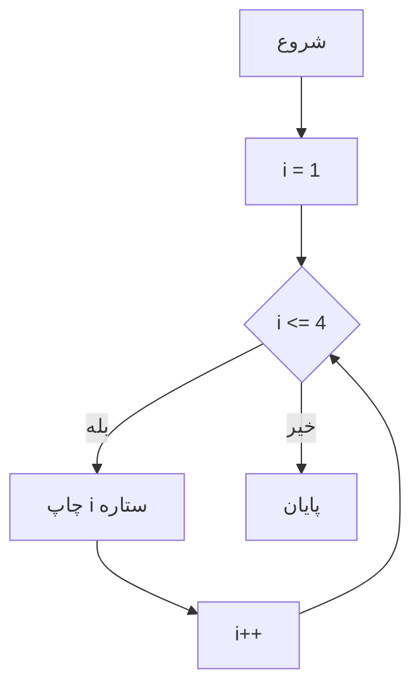


#### 3. فلوچارت `do-while`
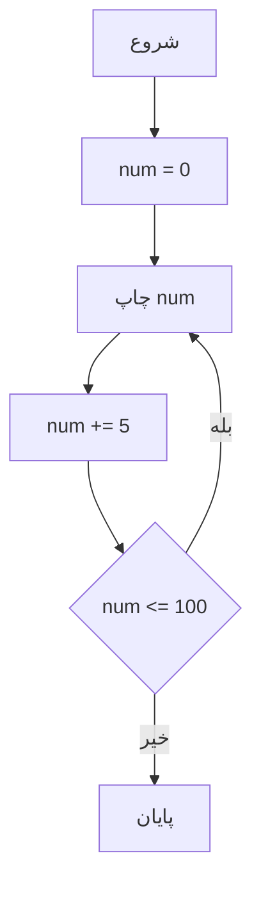

#### 4. فلوچارت `foreach`
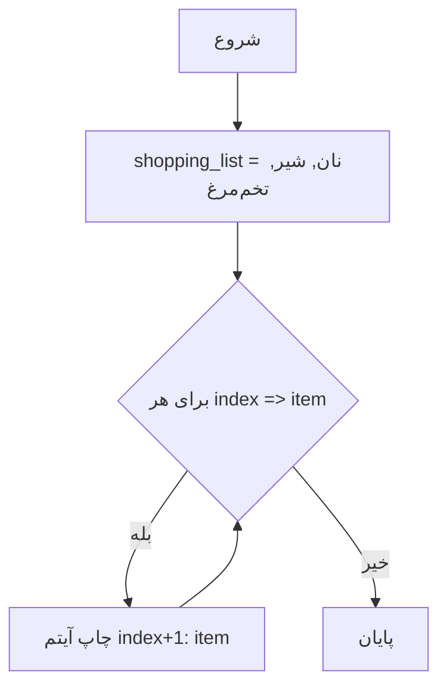

---

### تست کد
1. فایل رو با نام `loops3.php` ذخیره کن.
2. توی سرور PHP (مثل XAMPP) اجراش کن.
3. خروجی رو توی مرورگر ببین:
   ```
   الگوی ستاره:
   *
   **
   ***
   ****

   شمارش حروف:
   تعداد حروف 'سلام': 5

   افزایش با گام 5:
   0 5 10 15 20 25 30 35 40 45 50 55 60 65 70 75 80 85 90 95 100

   لیست خرید:
   آیتم 1: نان
   آیتم 2: شیر
   آیتم 3: تخم‌مرغ
   ```

---

این تمرین هم همه حلقه‌ها رو با یه سناریوی جدید و خلاقانه پوشش می‌ده. اگه بازم تمرین بیشتر می‌خوای یا چیزی رو تغییر بدم، بگو!


باشه، بیایم یه تمرین دیگه برای حلقه‌ها در PHP طراحی کنیم که کمی متفاوت باشه و بازم فقط از `for`, `while`, `do-while`, و `foreach` استفاده کنه. این بار یه سناریوی جدید و کاربردی‌تر می‌سازیم.

---

### سناریو تمرین:
برنامه‌ای بنویس که:


2. با `do-while` یه عدد رو تا وقتی به 20 نرسه، دو برابر کنه.
3. با `foreach` اسم و نمره چند دانش‌آموز رو از یه آرایه چاپ کنه.

---

### سودوکد (Pseudocode)
```
// شروع برنامه

// حلقه for برای جدول ضرب 3
FOR i = 1 TO 10 DO
    PRINT "3 * i = نتیجه"
ENDFOR


// حلقه do-while برای دو برابر کردن عدد تا 20
SET value = 1
DO
    PRINT value
    MULTIPLY value by 2
WHILE value < 20

// حلقه foreach برای چاپ اسم و نمره دانش‌آموزان
students = ["علی" => 18, "مریم" => 15, "رضا" => 20]
FOREACH name => score IN students DO
    PRINT "نام: name, نمره: score"
ENDFOREACH

// پایان برنامه
```

---

### کد اصلی (PHP) با کامنت فارسی و انگلیسی
```php
<?php
// 1. حلقه for برای جدول ضرب 3
// 1. For loop to print multiplication table of 3
echo "جدول ضرب 3:<br>";
for ($i = 1; $i <= 10; $i++) {
    $result = 3 * $i;
    echo "3 * $i = $result<br>"; // 3 * 1 = 3, 3 * 2 = 6, ...
}
echo "<br>";


// 3. حلقه do-while برای دو برابر کردن عدد تا 20
// 3. Do-while loop to double a number until 20
echo "دو برابر کردن تا 20:<br>";
$value = 1;
do {
    echo "$value "; // 1 2 4 8 16
    $value *= 2;    // دو برابر کردن
} while ($value < 20);
echo "<br><br>";

// 4. حلقه foreach برای چاپ اسم و نمره دانش‌آموزان
// 4. Foreach loop to print students' names and scores
echo "لیست دانش‌آموزان:<br>";
$students = ["علی" => 18, "مریم" => 15, "رضا" => 20];
foreach ($students as $name => $score) {
    echo "نام: $name, نمره: $score<br>"; // نام: علی, نمره: 18, ...
}
?>
```

---

### توضیحات کد
1. **`for`:**
   - از 1 تا 10 می‌چرخه و برای هر `$i`، ضرب 3 رو حساب و چاپ می‌کنه.
   - خروجی جدول ضرب 3 تا 10 می‌شه.


3. **`do-while`:**
   - از 1 شروع می‌کنه و در هر چرخه عدد رو دو برابر می‌کنه (`$value *= 2`).
   - تا وقتی `$value` به 20 نرسه ادامه می‌ده (16 آخرین مقدار قبل از 20ه).

4. **`foreach`:**
   - آرایه انجمنی `$students` رو می‌گیره که کلیدها اسم‌ها و مقادیر نمره‌ها هستن.
   - با `$name => $score` هر جفت کلید و مقدار رو جداگانه چاپ می‌کنه.

---

### کد تولید فلوچارت (با Mermaid)
#### 1. فلوچارت `for`
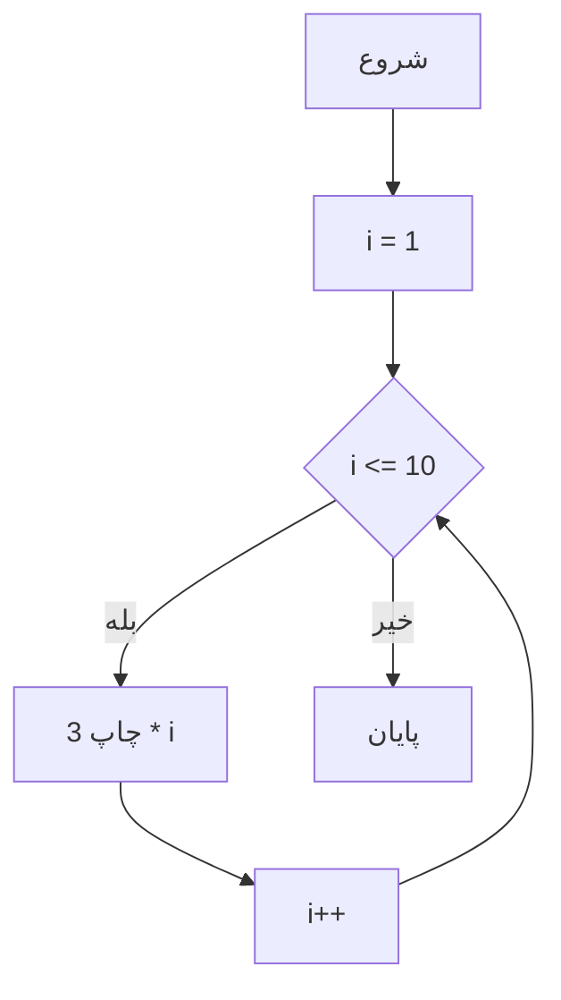


#### 3. فلوچارت `do-while`
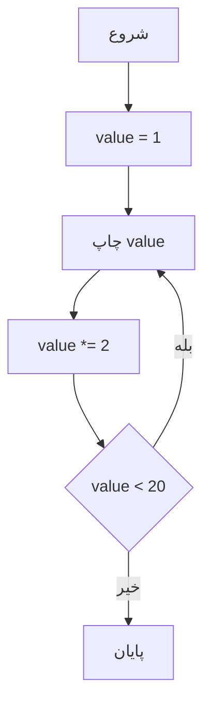

#### 4. فلوچارت `foreach`
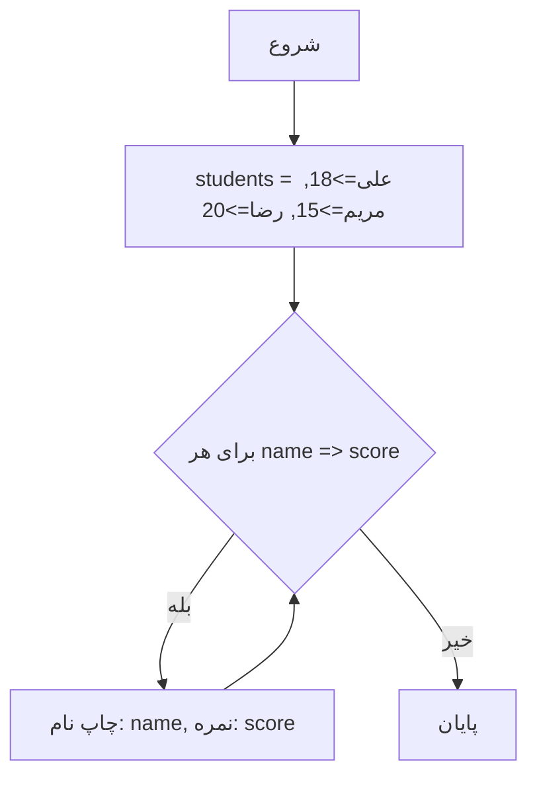

---

### تست کد
1. فایل رو با نام `loops2.php` ذخیره کن.
2. توی سرور PHP (مثل XAMPP) اجراش کن.
3. خروجی رو توی مرورگر ببین:
   ```
   جدول ضرب 3:
   3 * 1 = 3
   3 * 2 = 6
   3 * 3 = 9
   3 * 4 = 12
   3 * 5 = 15
   3 * 6 = 18
   3 * 7 = 21
   3 * 8 = 24
   3 * 9 = 27
   3 * 10 = 30

   جمع اعداد 1 تا 10:
   جمع = 55

   دو برابر کردن تا 20:
   1 2 4 8 16

   لیست دانش‌آموزان:
   نام: علی, نمره: 18
   نام: مریم, نمره: 15
   نام: رضا, نمره: 20
   ```

---

این تمرین بازم همه حلقه‌ها رو پوشش می‌ده، ولی با یه سناریوی جدید و کاربردی‌تر. اگه بازم تمرین بیشتر می‌خوای یا تغییر خاصی مدنظرت هست، بگو!

بیایم یه تمرین ساده و کاربردی برای حلقه‌ها (Loops) در PHP طراحی کنیم که از `for`, `while`, `do-while`, و `foreach` استفاده کنه. هدف اینه که با یه سناریوی واقعی این مفاهیم رو تمرین کنی.

---

### سناریو تمرین:
برنامه‌ای بنویس که:

1. با `while` یه شمارش معکوس از 5 تا 1 انجام بده.
2. با `do-while` یه عدد رو تا وقتی که به 10 برسه افزایش بده و نشون بده.
3. با `foreach` یه لیست از میوه‌ها رو از یه آرایه چاپ کنه.

---

### سودوکد (Pseudocode)
```
// شروع برنامه


// حلقه while برای شمارش معکوس از 5
SET count = 5
WHILE count > 0 DO
    PRINT count
    DECREMENT count
ENDWHILE

// حلقه do-while برای افزایش عدد تا 10
SET num = 0
DO
    PRINT num
    INCREMENT num
WHILE num < 10

// حلقه foreach برای چاپ آرایه میوه‌ها
fruits = ["سیب", "موز", "پرتقال"]
FOREACH fruit IN fruits DO
    PRINT fruit
ENDFOREACH

// پایان برنامه
```

---

### کد اصلی (PHP) با کامنت فارسی و انگلیسی
```php
<?php
	
echo "<br><br>";

// 2. حلقه while برای شمارش معکوس از 5
// 2. While loop for countdown from 5
echo "حلقه while:<br>";
$count = 5;
while ($count > 0) {
    echo "$count "; // 5 4 3 2 1
    $count--;
}
echo "<br><br>";

// 3. حلقه do-while برای افزایش عدد تا 10
// 3. Do-while loop to increase number up to 10
echo "حلقه do-while:<br>";
$num = 0;
do {
    echo "$num "; // 0 1 2 3 4 5 6 7 8 9
    $num++;
} while ($num < 10);
echo "<br><br>";

// 4. حلقه foreach برای چاپ لیست میوه‌ها
// 4. Foreach loop to print list of fruits
echo "حلقه foreach:<br>";
$fruits = ["سیب", "موز", "پرتقال"];
foreach ($fruits as $fruit) {
    echo "$fruit<br>"; // سیب, موز, پرتقال
}
?>
```

---

### توضیحات کد


2. **`while`:**
   - تا وقتی `$count` بزرگ‌تر از 0 باشه، عدد رو چاپ می‌کنه و بعدش کم می‌کنه (`$count--`).
   - شمارش معکوس از 5 تا 1 رو نشون می‌ده.

3. **`do-while`:**
   - ابتدا `$num` رو چاپ می‌کنه، بعدش زیادش می‌کنه (`$num++`)، و تا وقتی کمتر از 10 باشه ادامه می‌ده.
   - حداقل یک بار اجرا می‌شه، حتی اگه شرط اول درست نباشه.

4. **`foreach`:**
   - آرایه `$fruits` رو می‌گیره و هر عنصرش رو توی متغیر `$fruit` می‌ریزه و چاپ می‌کنه.
   - `<br>` برای جداسازی خطوط اضافه شده.

---

### کد تولید فلوچارت (با Mermaid)
به دلیل اینکه چهار حلقه جدا داریم، برای هر کدوم یه بخش ساده می‌ذارم:


#### 2. فلوچارت `while`
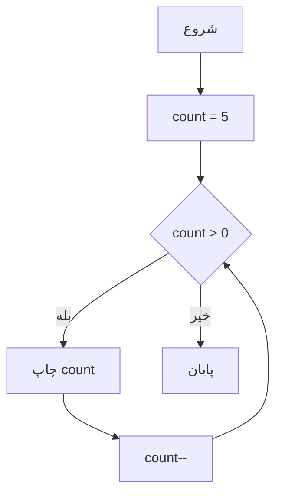

#### 3. فلوچارت `do-while`
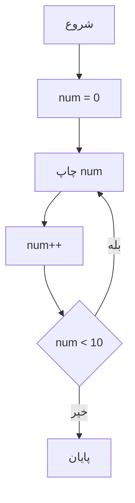

#### 4. فلوچارت `foreach`
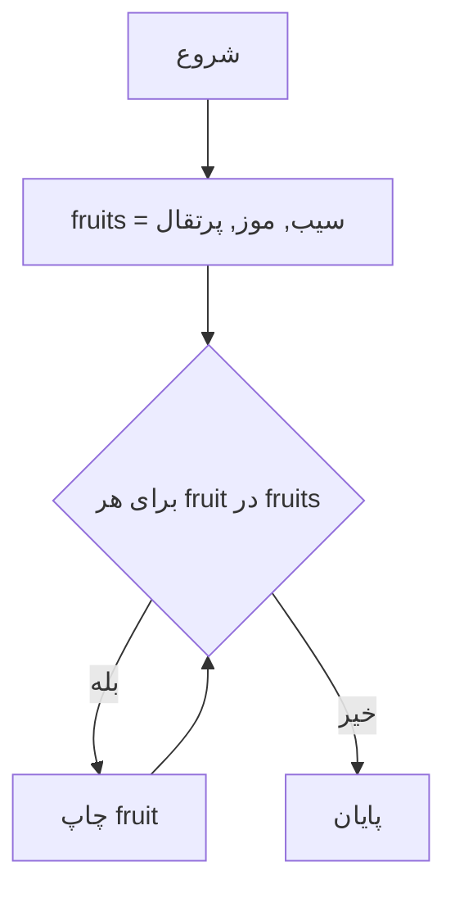

---

### تست کد
1. فایل رو با نام `loops.php` ذخیره کن.
2. توی سرور PHP (مثل XAMPP) اجراش کن.
3. خروجی رو توی مرورگر ببین:
   ```
   حلقه for:
   1 2 3 4 5

   حلقه while:
   5 4 3 2 1

   حلقه do-while:
   0 1 2 3 4 5 6 7 8 9

   حلقه foreach:
   سیب
   موز
   پرتقال
   ```

---

این تمرین همه حلقه‌ها (`for`, `while`, `do-while`, `foreach`) رو به شکل ساده و قابل‌فهم پوشش می‌ده. اگه سوالی داری یا می‌خوای تغییرش بدم، بگو!
باشه، یه تمرین دیگه برای حلقه‌ها در PHP طراحی می‌کنم که بازم فقط از `for`, `while`, `do-while`, و `foreach` استفاده کنه. این بار سناریویی انتخاب می‌کنم که کمی چالش‌برانگیزتر باشه و کاربرد روزمره داشته باشه.

---

### سناریو تمرین:
برنامه‌ای بنویس که:

1. با `while` یه عدد رو تا وقتی زوج بشه افزایش بده و تعداد مراحل رو بشماره.
2. با `do-while` یه عدد رو تا وقتی به توان 2 (مثل 2, 4, 8) نرسه، دو برابر کنه.
3. با `foreach` موجودی انبار (اسم و تعداد) رو از یه آرایه چاپ کنه و جمع کل رو حساب کنه.

---

### سودوکد (Pseudocode)
```
// شروع برنامه


// حلقه while برای پیدا کردن اولین عدد زوج
SET number = 7
SET steps = 0
WHILE number % 2 != 0 DO
    INCREMENT number
    INCREMENT steps
ENDWHILE
PRINT "اولین زوج: number, مراحل: steps"

// حلقه do-while برای توان‌های 2
SET power = 1
DO
    PRINT power
    MULTIPLY power by 2
WHILE power <= 16

// حلقه foreach برای موجودی انبار
inventory = ["کتاب" => 5, "مداد" => 10, "خودکار" => 8]
SET total = 0
FOREACH item => quantity IN inventory DO
    PRINT "آیتم: item, تعداد: quantity"
    ADD quantity to total
ENDFOREACH
PRINT "جمع کل: total"

// پایان برنامه
```

---

### کد اصلی (PHP) با کامنت فارسی و انگلیسی


```php
<?php

echo "<br><br>";

// 2. حلقه while برای پیدا کردن اولین عدد زوج
// 2. While loop to find the first even number
echo "پیدا کردن اولین زوج:<br>";
$number = 7;
$steps = 0;
while ($number % 2 != 0) {
    $number++; // افزایش تا زوج بشه
    $steps++;   // شمارش مراحل
}
echo "اولین زوج: $number, تعداد مراحل: $steps<br><br>"; // First even: 8, Steps: 1

// 3. حلقه do-while برای توان‌های 2
// 3. Do-while loop for powers of 2
echo "توان‌های 2:<br>";
$power = 1;
do {
    echo "$power "; // 1 2 4 8 16
    $power *= 2;    // دو برابر کردن
} while ($power <= 16);
echo "<br><br>";

// 4. حلقه foreach برای موجودی انبار
// 4. Foreach loop to print inventory and calculate total
echo "موجودی انبار:<br>";
$inventory = ["کتاب" => 5, "مداد" => 10, "خودکار" => 8];
$total = 0;
foreach ($inventory as $item => $quantity) {
    echo "آیتم: $item, تعداد: $quantity<br>";
    $total += $quantity; // جمع تعداد
}
echo "جمع کل موجودی: $total<br>"; // Total inventory: 23
?>
```

---

### توضیحات کد
1. **`while`:**
   - از عدد 7 شروع می‌کنه و تا وقتی زوج بشه (`% 2 == 0`)، `$number` رو زیاد می‌کنه.
   - `$steps` تعداد دفعات افزایش رو می‌شماره (اینجا 1 مرحله).

3. **`do-while`:**
   - از 1 شروع می‌کنه و هر بار `$power` رو دو برابر می‌کنه تا به 16 برسه.
   - خروجی: 1 2 4 8 16.

4. **`foreach`:**
   - آرایه `$inventory` رو می‌گیره و برای هر آیتم، اسم و تعداد رو چاپ می‌کنه.
   - `$total` جمع کل تعداد آیتم‌ها رو حساب می‌کنه (5 + 10 + 8 = 23).

---

### کد تولید فلوچارت (با Mermaid)

#### 2. فلوچارت `while`
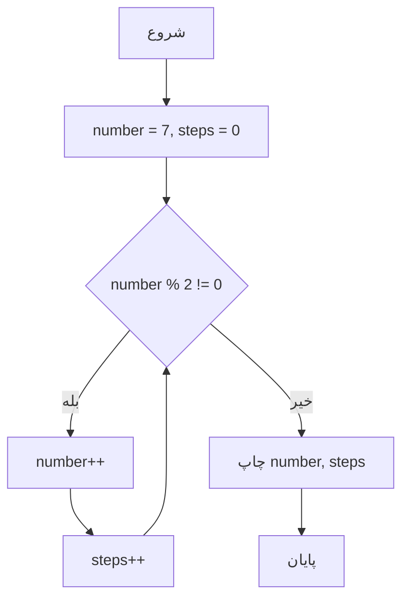

#### 3. فلوچارت `do-while`
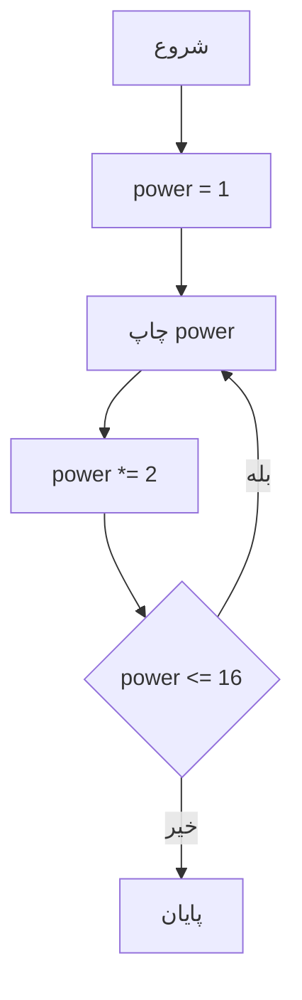

#### 4. فلوچارت `foreach`
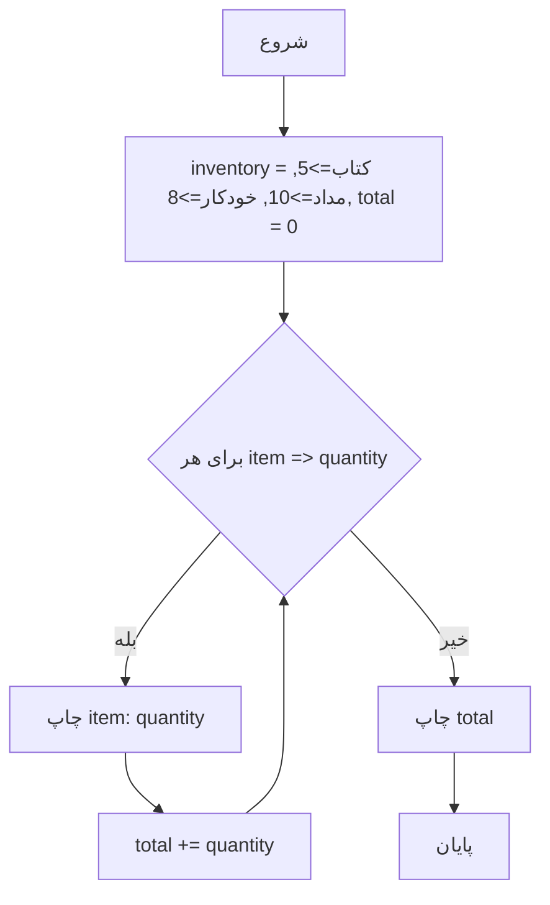

---

### تست کد
1. فایل رو با نام `loops4.php` ذخیره کن.
2. توی سرور PHP (مثل XAMPP) اجراش کن.
3. خروجی رو توی مرورگر ببین:
   ```
   اعداد زوج 1 تا 10:
   2 4 6 8 10

   پیدا کردن اولین زوج:
   اولین زوج: 8, تعداد مراحل: 1

   توان‌های 2:
   1 2 4 8 16

   موجودی انبار:
   آیتم: کتاب, تعداد: 5
   آیتم: مداد, تعداد: 10
   آیتم: خودکار, تعداد: 8
   جمع کل موجودی: 23
   ```

---

این تمرین هم همه حلقه‌ها رو با یه سناریوی جدید و کمی چالش‌برانگیز پوشش می‌ده. اگه بازم تمرین بیشتر می‌خوای یا چیزی رو تغییر بدم، بگو!
باشه، یه تمرین دیگه برای حلقه‌ها در PHP طراحی می‌کنم که فقط از `for`, `while`, `do-while`, و `foreach` استفاده کنه. این بار سناریویی می‌سازیم که هم ساده باشه و هم به مسائل ریاضی و روزمره ربط داشته باشه.

---

### سناریو تمرین:
برنامه‌ای بنویس که:

1. با `while` بزرگ‌ترین توان 2 که از 50 کمتره رو پیدا کنه.
2. با `do-while` یه عدد رو تا وقتی از 30 رد نشه، 3 واحد اضافه کنه.
3. با `foreach` روزهای هفته رو از یه آرایه چاپ کنه و تعداد حروف هر روز رو بشماره.

---

### سودوکد (Pseudocode)
```
// شروع برنامه


// حلقه while برای بزرگ‌ترین توان 2 کمتر از 50
SET power = 1
WHILE power * 2 < 50 DO
    MULTIPLY power by 2
ENDWHILE
PRINT "بزرگ‌ترین توان 2: power"

// حلقه do-while برای افزایش عدد با گام 3 تا 30
SET num = 0
DO
    PRINT num
    ADD 3 to num
WHILE num <= 30

// حلقه foreach برای چاپ روزها و تعداد حروف
days = ["شنبه", "یکشنبه", "دوشنبه"]
FOREACH day IN days DO
    PRINT "روز: day, حروف: طول day"
ENDFOREACH

// پایان برنامه
```

---

### کد اصلی (PHP) با کامنت فارسی و انگلیسی
```php
<?php

// 2. حلقه while برای بزرگ‌ترین توان 2 کمتر از 50
// 2. While loop to find largest power of 2 less than 50
echo "بزرگ‌ترین توان 2 کمتر از 50:<br>";
$power = 1;
while ($power * 2 < 50) {
    $power *= 2; // دو برابر کردن تا نزدیک 50
}
echo "بزرگ‌ترین توان 2: $power<br><br>"; // Largest power of 2: 32

// 3. حلقه do-while برای افزایش عدد با گام 3
// 3. Do-while loop to increase number by 3 until over 30
echo "افزایش با گام 3:<br>";
$num = 0;
do {
    echo "$num "; // 0 3 6 9 12 15 18 21 24 27 30
    $num += 3;    // اضافه کردن 3
} while ($num <= 30);
echo "<br><br>";

// 4. حلقه foreach برای چاپ روزها و تعداد حروف
// 4. Foreach loop to print days and count characters
echo "روزهای هفته:<br>";
$days = ["شنبه", "یکشنبه", "دوشنبه"];
foreach ($days as $day) {
    $char_count = strlen($day); // شمارش حروف
    echo "روز: $day, حروف: $char_count<br>";
    // خروجی:
    // روز: شنبه, حروف: 5
    // روز: یکشنبه, حروف: 7
    // روز: دوشنبه, حروف: 7
}
?>
```

---

### توضیحات کد

2. **`while`:**
   - از 1 شروع می‌کنه و `$power` رو دو برابر می‌کنه تا وقتی از 50 رد نشه.
   - بزرگ‌ترین توان 2 که کمتر از 50ه، 32 می‌شه.

3. **`do-while`:**
   - از 0 شروع می‌کنه و هر بار 3 واحد به `$num` اضافه می‌کنه (`$num += 3`).
   - تا وقتی `$num` از 30 رد نشه ادامه می‌ده (آخرین مقدار 30ه).

4. **`foreach`:**
   - آرایه `$days` رو می‌گیره و برای هر روز، اسم و تعداد حروفش رو با `strlen()` چاپ می‌کنه.

---

### کد تولید فلوچارت (با Mermaid)

#### 2. فلوچارت `while`
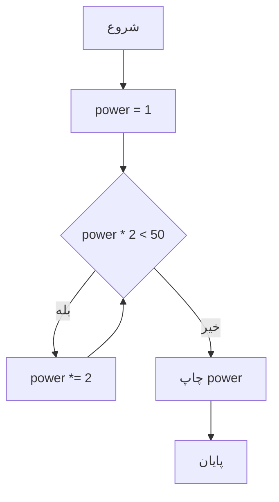

#### 3. فلوچارت `do-while`
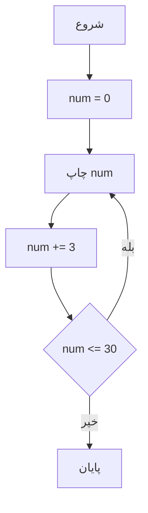

#### 4. فلوچارت `foreach`
```mermaid
graph TD
    A[شروع] --> B[days = شنبه, یکشنبه, دوشنبه]
    B --> C{برای هر day}
    C -->|بله| D[چاپ day, strlen(day)]
    D --> C
    C -->|خیر| E[پایان]
```

---

### تست کد
1. فایل رو با نام `loops5.php` ذخیره کن.
2. توی سرور PHP (مثل XAMPP) اجراش کن.
3. خروجی رو توی مرورگر ببین:
   ```
   محاسبه فاکتوریل 5:
   فاکتوریل 5: 120

   بزرگ‌ترین توان 2 کمتر از 50:
   بزرگ‌ترین توان 2: 32

   افزایش با گام 3:
   0 3 6 9 12 15 18 21 24 27 30

   روزهای هفته:
   روز: شنبه, حروف: 5
   روز: یکشنبه, حروف: 7
   روز: دوشنبه, حروف: 7
   ```

---

این تمرین هم همه حلقه‌ها رو با یه سناریوی جدید و مرتبط با ریاضی و زندگی روزمره پوشش می‌ده. اگه بازم تمرین می‌خوای یا چیزی رو تغییر بدم، بگو!

باشه، از این به بعد برای هر مثال حلقه‌ها در PHP، جدول صحت (Truth Table) هم اضافه می‌کنم. جدول صحت معمولاً برای شرط‌ها و عملگرهای منطقی استفاده می‌شه، اما چون اینجا حلقه داریم، من شرط‌های کلیدی هر حلقه رو به صورت جدول صحت نشون می‌دم تا منطقش مشخص بشه. حالا یه تمرین جدید می‌دم:

---

### سناریو تمرین:
برنامه‌ای بنویس که:

1. با `while` یه عدد رو تا وقتی از 15 کمتره، 2 واحد اضافه کنه.
2. با `do-while` یه عدد رو تا وقتی از 10 رد نشه، 3 برابر کنه.
3. با `foreach` رنگ‌های یه آرایه رو چاپ کنه و چک کنه آیا طول اسمشون بیشتر از 4 حرف هست یا نه.

---

### سودوکد (Pseudocode)
```
// شروع برنامه


// حلقه while برای افزایش عدد تا 15
SET num = 0
WHILE num < 15 DO
    PRINT num
    ADD 2 to num
ENDWHILE

// حلقه do-while برای 3 برابر کردن تا 10
SET value = 1
DO
    PRINT value
    MULTIPLY value by 3
WHILE value <= 10

// حلقه foreach برای چاپ رنگ‌ها و بررسی طول
colors = ["قرمز", "آبی", "سبز"]
FOREACH color IN colors DO
    IF length of color > 4 THEN
        PRINT "رنگ: color, طولانی"
    ELSE
        PRINT "رنگ: color, کوتاه"
    ENDIF
ENDFOREACH

// پایان برنامه
```

---

### کد اصلی (PHP) با کامنت فارسی و انگلیسی
```php
<?php

echo "<br><br>";

// 2. حلقه while برای افزایش عدد تا 15
// 2. While loop to increase number by 2 until 15
echo "افزایش تا 15:<br>";
$num = 0;
while ($num < 15) {
    echo "$num "; // 0 2 4 6 8 10 12 14
    $num += 2;    // اضافه کردن 2
}
echo "<br><br>";

// 3. حلقه do-while برای 3 برابر کردن تا 10
// 3. Do-while loop to triple a number until over 10
echo "سه برابر کردن تا 10:<br>";
$value = 1;
do {
    echo "$value "; // 1 3 9
    $value *= 3;    // سه برابر کردن
} while ($value <= 10);
echo "<br><br>";

// 4. حلقه foreach برای چاپ رنگ‌ها و بررسی طول
// 4. Foreach loop to print colors and check length
echo "رنگ‌ها و طول:<br>";
$colors = ["قرمز", "آبی", "سبز"];
foreach ($colors as $color) {
    $length = strlen($color);
    if ($length > 4) {
        echo "رنگ: $color, طولانی<br>"; // Length > 4
    } else {
        echo "رنگ: $color, کوتاه<br>";  // Length <= 4
    }
}
?>
```

---

### جدول صحت (Truth Table) برای شرط‌های هر حلقه
#### 1. حلقه `for` (شرط: `$i % 2 != 0`)
| `$i` | `$i % 2` | `$i % 2 != 0` | نتیجه (چاپ می‌شود؟) |
|------|----------|---------------|---------------------|
| 1    | 1        | True          | بله                |
| 2    | 0        | False         | خیر                |
| 3    | 1        | True          | بله                |
| 4    | 0        | False         | خیر                |
| 5    | 1        | True          | بله                |
| ...  | ...      | ...           | ...                |


- **توضیح:** فقط وقتی `$i % 2 != 0` درست باشه (یعنی عدد فرد باشه)، `$i` چاپ می‌شه.

#### 2. حلقه `while` (شرط: `$num < 15`)
| `$num` | `$num < 15` | نتیجه (حلقه ادامه می‌یابد؟) |
|--------|-------------|-----------------------------|
| 0      | True        | بله                        |
| 2      | True        | بله                        |
| 4      | True        | بله                        |
| ...    | ...         | ...                        |
| 14     | True        | بله                        |
| 16     | False       | خیر (حلقه تمام می‌شود)     |
- **توضیح:** حلقه تا وقتی `$num < 15` درست باشه ادامه داره.

#### 3. حلقه `do-while` (شرط: `$value <= 10`)
| `$value` | `$value <= 10` | نتیجه (حلقه ادامه می‌یابد؟) |
|----------|----------------|-----------------------------|
| 1        | True           | بله                        |
| 3        | True           | بله                        |
| 9        | True           | بله                        |
| 27       | False          | خیر (حلقه تمام می‌شود)     |
- **توضیح:** حلقه حداقل یک بار اجرا می‌شه و تا وقتی `$value <= 10` درست باشه ادامه داره.

#### 4. حلقه `foreach` (شرط: `$length > 4`)
| `$color` | `$length` | `$length > 4` | نتیجه (طولانی یا کوتاه) |
|----------|-----------|---------------|-------------------------|
| قرمز     | 5         | True          | طولانی                  |
| آبی      | 3         | False         | کوتاه                   |
| سبز      | 3         | False         | کوتاه                   |
- **توضیح:** برای هر رنگ، اگه طولش بیشتر از 4 باشه "طولانی" وگرنه "کوتاه" چاپ می‌شه.

---

### کد تولید فلوچارت (با Mermaid)

#### 2. فلوچارت `while`
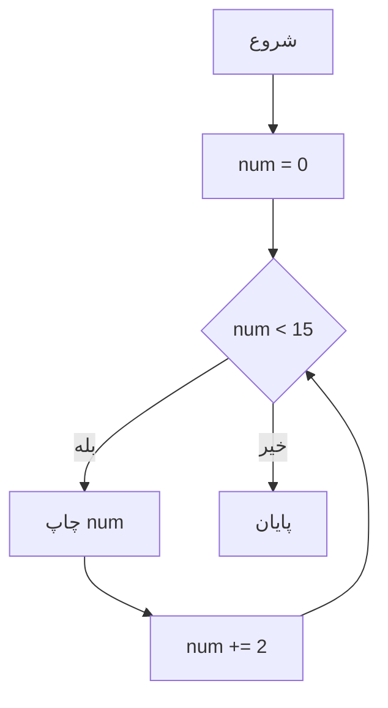

#### 3. فلوچارت `do-while`
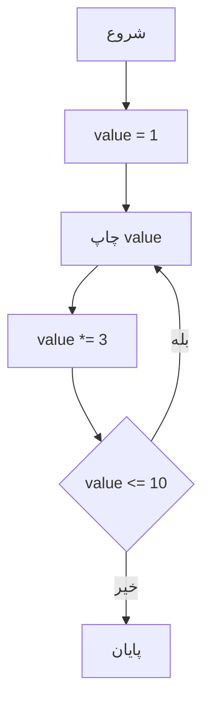

#### 4. فلوچارت `foreach`
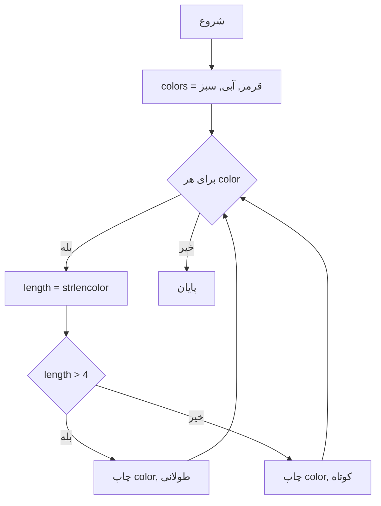

---

### تست کد
1. فایل رو با نام `loops6.php` ذخیره کن.
2. توی سرور PHP (مثل XAMPP) اجراش کن.
3. خروجی رو توی مرورگر ببین:
   ```
   اعداد فرد 1 تا 10:
   1 3 5 7 9

   افزایش تا 15:
   0 2 4 6 8 10 12 14

   سه برابر کردن تا 10:
   1 3 9

   رنگ‌ها و طول:
   رنگ: قرمز, طولانی
   رنگ: آبی, کوتاه
   رنگ: سبز, کوتاه
   ```

---

این تمرین همه حلقه‌ها رو با جدول صحت برای شرط‌هاشون پوشش می‌ده. اگه بازم تمرین می‌خوای یا چیزی رو تغییر بدم، بگو!


باشه، یه تمرین دیگه برای حلقه‌ها در PHP طراحی می‌کنم که از `for`, `while`, `do-while`, و `foreach` استفاده کنه و برای هر حلقه جدول صحت (Truth Table) هم بیارم. این بار سناریویی می‌سازیم که به محاسبات و بررسی داده‌ها مرتبط باشه.

---

### سناریو تمرین:
برنامه‌ای بنویس که:

1. با `while` یه عدد رو تا وقتی از 25 کمتره، 3 واحد اضافه کنه.
2. با `do-while` یه عدد رو تا وقتی از 40 رد نشه، 4 برابر کنه.
3. با `foreach` اسامی حیوانات رو از یه آرایه چاپ کنه و چک کنه آیا طول اسمشون زوجه یا نه.

---

### سودوکد (Pseudocode)
```
// شروع برنامه


// حلقه while برای افزایش عدد تا 25
SET num = 0
WHILE num < 25 DO
    PRINT num
    ADD 3 to num
ENDWHILE

// حلقه do-while برای 4 برابر کردن تا 40
SET value = 1
DO
    PRINT value
    MULTIPLY value by 4
WHILE value <= 40

// حلقه foreach برای حیوانات و بررسی طول
animals = ["گربه", "سگ", "پلنگ"]
FOREACH animal IN animals DO
    IF length of animal % 2 == 0 THEN
        PRINT "حیوان: animal, طول زوج"
    ELSE
        PRINT "حیوان: animal, طول فرد"
    ENDIF
ENDFOREACH

// پایان برنامه
```

---

### کد اصلی (PHP) با کامنت فارسی و انگلیسی
```php
<?php

// 2. حلقه while برای افزایش عدد تا 25
// 2. While loop to increase number by 3 until 25
echo "افزایش تا 25:<br>";
$num = 0;
while ($num < 25) {
    echo "$num "; // 0 3 6 9 12 15 18 21 24
    $num += 3;    // اضافه کردن 3
}
echo "<br><br>";

// 3. حلقه do-while برای 4 برابر کردن تا 40
// 3. Do-while loop to multiply by 4 until over 40
echo "چهار برابر کردن تا 40:<br>";
$value = 1;
do {
    echo "$value "; // 1 4 16
    $value *= 4;    // چهار برابر کردن
} while ($value <= 40);
echo "<br><br>";

// 4. حلقه foreach برای حیوانات و بررسی طول
// 4. Foreach loop to print animals and check length parity
echo "حیوانات و طول:<br>";
$animals = ["گربه", "سگ", "پلنگ"];
foreach ($animals as $animal) {
    $length = strlen($animal); // طول نام حیوان
    if ($length % 2 == 0) {
        echo "حیوان: $animal, طول زوج<br>";
    } else {
        echo "حیوان: $animal, طول فرد<br>";
    }
}
?>
```

---

### جدول صحت (Truth Table) برای شرط‌های هر حلقه


#### 2. حلقه `while` (شرط: `$num < 25`)
| `$num` | `$num < 25` | نتیجه (حلقه ادامه می‌یابد؟) |
|--------|-------------|-----------------------------|
| 0      | True        | بله                        |
| 3      | True        | بله                        |
| 6      | True        | بله                        |
| ...    | ...         | ...                        |
| 24     | True        | بله                        |
| 27     | False       | خیر (حلقه تمام می‌شود)     |
- **توضیح:** حلقه تا وقتی `$num < 25` درست باشه ادامه داره.

#### 3. حلقه `do-while` (شرط: `$value <= 40`)
| `$value` | `$value <= 40` | نتیجه (حلقه ادامه می‌یابد؟) |
|----------|----------------|-----------------------------|
| 1        | True           | بله                        |
| 4        | True           | بله                        |
| 16       | True           | بله                        |
| 64       | False          | خیر (حلقه تمام می‌شود)     |
- **توضیح:** حلقه تا وقتی `$value <= 40` درست باشه ادامه داره و حداقل یک بار اجرا می‌شه.

#### 4. حلقه `foreach` (شرط: `$length % 2 == 0`)
| `$animal` | `$length` | `$length % 2 == 0` | نتیجه (زوج یا فرد) |
|-----------|-----------|-------------------|-------------------|
| گربه      | 4         | True              | زوج               |
| سگ        | 2         | True              | زوج               |
| پلنگ      | 5         | False             | فرد               |
- **توضیح:** اگه طول زوج باشه "طول زوج" و اگه فرد باشه "طول فرد" چاپ می‌شه.

---

### کد تولید فلوچارت (با Mermaid)


#### 2. فلوچارت `while`


#### 3. فلوچارت `do-while`


#### 4. فلوچارت `foreach`
```mermaid
graph TD
    A[شروع] --> B[animals = گربه, سگ, پلنگ]
    B --> C{برای هر animal}
    C -->|بله| D[length = strlen animal]
    D --> E{length % 2 == 0}
    E -->|بله| F[چاپ animal, طول زوج]
    E -->|خیر| G[چاپ animal, طول فرد]
    F --> C
    G --> C
    C -->|خیر| H[پایان]
```

---

### تست کد
1. فایل رو با نام `loops8.php` ذخیره کن.
2. توی سرور PHP (مثل XAMPP) اجراش کن.
3. خروجی رو توی مرورگر ببین:
   ```
   جمع اعداد خاص (1 تا 10):
   جمع: 13

   افزایش تا 25:
   0 3 6 9 12 15 18 21 24

   چهار برابر کردن تا 40:
   1 4 16

   حیوانات و طول:
   حیوان: گربه, طول زوج
   حیوان: سگ, طول زوج
   حیوان: پلنگ, طول فرد
   ```

---

این تمرین هم همه حلقه‌ها رو با جدول صحت برای شرط‌هاشون پوشش می‌ده. اگه بازم تمرین می‌خوای یا تغییر خاصی مدنظرت هست، بگو!

باشه، یه تمرین دیگه برای حلقه‌ها در PHP طراحی می‌کنم که از `for`, `while`, `do-while`, و `foreach` استفاده کنه و برای هر حلقه جدول صحت (Truth Table) هم بیارم. این بار سناریویی می‌سازیم که به مسائل عددی و تحلیل داده‌های ساده مرتبط باشه.

---

### سناریو تمرین:
برنامه‌ای بنویس که:

1. با `while` یه عدد رو تا وقتی از 30 کمتره، 5 واحد اضافه کنه.
2. با `do-while` یه عدد رو تا وقتی از 60 رد نشه، 6 برابر کنه.
3. با `foreach` محصولات یه آرایه رو چاپ کنه و چک کنه آیا قیمتشون بیشتر از 1000ه یا نه.

---

### سودوکد (Pseudocode)
```
// شروع برنامه


// حلقه while برای افزایش عدد تا 30
SET num = 0
WHILE num < 30 DO
    PRINT num
    ADD 5 to num
ENDWHILE

// حلقه do-while برای 6 برابر کردن تا 60
SET value = 1
DO
    PRINT value
    MULTIPLY value by 6
WHILE value <= 60

// حلقه foreach برای محصولات و بررسی قیمت
products = ["کتاب" => 500, "لپ‌تاپ" => 2000, "مداد" => 300]
FOREACH product => price IN products DO
    IF price > 1000 THEN
        PRINT "محصول: product, گران"
    ELSE
        PRINT "محصول: product, ارزان"
    ENDIF
ENDFOREACH

// پایان برنامه
```

---

### کد اصلی (PHP) با کامنت فارسی و انگلیسی
```php
<?php

echo "<br><br>";

// 2. حلقه while برای افزایش عدد تا 30
// 2. While loop to increase number by 5 until 30
echo "افزایش تا 30:<br>";
$num = 0;
while ($num < 30) {
    echo "$num "; // 0 5 10 15 20 25
    $num += 5;    // اضافه کردن 5
}
echo "<br><br>";

// 3. حلقه do-while برای 6 برابر کردن تا 60
// 3. Do-while loop to multiply by 6 until over 60
echo "شش برابر کردن تا 60:<br>";
$value = 1;
do {
    echo "$value "; // 1 6 36
    $value *= 6;    // شش برابر کردن
} while ($value <= 60);
echo "<br><br>";

// 4. حلقه foreach برای محصولات و بررسی قیمت
// 4. Foreach loop to print products and check price
echo "محصولات و قیمت:<br>";
$products = ["کتاب" => 500, "لپ‌تاپ" => 2000, "مداد" => 300];
foreach ($products as $product => $price) {
    if ($price > 1000) {
        echo "محصول: $product, گران<br>";
    } else {
        echo "محصول: $product, ارزان<br>";
    }
}
?>
```

---

### جدول صحت (Truth Table) برای شرط‌های هر حلقه


#### 2. حلقه `while` (شرط: `$num < 30`)
| `$num` | `$num < 30` | نتیجه (حلقه ادامه می‌یابد؟) |
|--------|-------------|-----------------------------|
| 0      | True        | بله                        |
| 5      | True        | بله                        |
| 10     | True        | بله                        |
| ...    | ...         | ...                        |
| 25     | True        | بله                        |
| 30     | False       | خیر (حلقه تمام می‌شود)     |
- **توضیح:** حلقه تا وقتی `$num < 30` درست باشه ادامه داره.

#### 3. حلقه `do-while` (شرط: `$value <= 60`)
| `$value` | `$value <= 60` | نتیجه (حلقه ادامه می‌یابد؟) |
|----------|----------------|-----------------------------|
| 1        | True           | بله                        |
| 6        | True           | بله                        |
| 36       | True           | بله                        |
| 216      | False          | خیر (حلقه تمام می‌شود)     |
- **توضیح:** حلقه تا وقتی `$value <= 60` درست باشه ادامه داره و حداقل یک بار اجرا می‌شه.

#### 4. حلقه `foreach` (شرط: `$price > 1000`)
| `$product` | `$price` | `$price > 1000` | نتیجه (گران یا ارزان) |
|------------|----------|----------------|----------------------|
| کتاب       | 500      | False          | ارزان                |
| لپ‌تاپ    | 2000     | True           | گران                 |
| مداد       | 300      | False          | ارزان                |
- **توضیح:** اگه قیمت بیشتر از 1000 باشه "گران" و اگه کمتر یا مساوی باشه "ارزان" چاپ می‌شه.

---

### کد تولید فلوچارت (با Mermaid)


#### 2. فلوچارت `while`
```mermaid
graph TD
    A[شروع] --> B[num = 0]
    B --> C{num < 30}
    C -->|بله| D[چاپ num]
    D --> E[num += 5]
    E --> C
    C -->|خیر| F[پایان]
```

#### 3. فلوچارت `do-while`
```mermaid
graph TD
    A[شروع] --> B[value = 1]
    B --> C[چاپ value]
    C --> D[value *= 6]
    D --> E{value <= 60}
    E -->|بله| C
    E -->|خیر| F[پایان]
```

#### 4. فلوچارت `foreach`
```mermaid
graph TD
    A[شروع] --> B[products = کتاب=>500, لپ‌تاپ=>2000, مداد=>300]
    B --> C{برای هر product => price}
    C -->|بله| D{price > 1000}
    D -->|بله| E[چاپ product, گران]
    D -->|خیر| F[چاپ product, ارزان]
    E --> C
    F --> C
    C -->|خیر| G[پایان]
```

---

### تست کد
1. فایل رو با نام `loops9.php` ذخیره کن.
2. توی سرور PHP (مثل XAMPP) اجراش کن.
3. خروجی رو توی مرورگر ببین:
   ```
   اعداد قابل‌تقسیم بر 4 (1 تا 12):
   4 8 12

   افزایش تا 30:
   0 5 10 15 20 25

   شش برابر کردن تا 60:
   1 6 36

   محصولات و قیمت:
   محصول: کتاب, ارزان
   محصول: لپ‌تاپ, گران
   محصول: مداد, ارزان
   ```

---

باشه، یه تمرین دیگه برای حلقه‌ها در PHP طراحی می‌کنم که از `for`, `while`, `do-while`, و `foreach` استفاده کنه و برای هر حلقه جدول صحت (Truth Table) هم بیارم. این بار سناریویی می‌سازیم که به مسائل عددی و دسته‌بندی داده‌ها مرتبط باشه.

---

### سناریو تمرین:
برنامه‌ای بنویس که:

1. با `while` یه عدد رو تا وقتی از 40 کمتره، 7 واحد اضافه کنه.
2. با `do-while` یه عدد رو تا وقتی از 80 رد نشه، 8 برابر کنه.
3. با `foreach` اسامی غذا‌ها رو از یه آرایه چاپ کنه و چک کنه آیا تعداد حروفشون کمتر از 5ه یا نه.

---

### سودوکد (Pseudocode)
```
// شروع برنامه


// حلقه while برای افزایش عدد تا 40
SET num = 0
WHILE num < 40 DO
    PRINT num
    ADD 7 to num
ENDWHILE

// حلقه do-while برای 8 برابر کردن تا 80
SET value = 1
DO
    PRINT value
    MULTIPLY value by 8
WHILE value <= 80

// حلقه foreach برای غذاها و بررسی طول
foods = ["پیتزا", "کباب", "سوپ"]
FOREACH food IN foods DO
    IF length of food < 5 THEN
        PRINT "غذا: food, کوتاه"
    ELSE
        PRINT "غذا: food, بلند"
    ENDIF
ENDFOREACH

// پایان برنامه
```

---

### کد اصلی (PHP) با کامنت فارسی و انگلیسی
```php
<?php

echo "<br><br>";

// 2. حلقه while برای افزایش عدد تا 40
// 2. While loop to increase number by 7 until 40
echo "افزایش تا 40:<br>";
$num = 0;
while ($num < 40) {
    echo "$num "; // 0 7 14 21 28 35
    $num += 7;    // اضافه کردن 7
}
echo "<br><br>";

// 3. حلقه do-while برای 8 برابر کردن تا 80
// 3. Do-while loop to multiply by 8 until over 80
echo "هشت برابر کردن تا 80:<br>";
$value = 1;
do {
    echo "$value "; // 1 8 64
    $value *= 8;    // هشت برابر کردن
} while ($value <= 80);
echo "<br><br>";

// 4. حلقه foreach برای غذاها و بررسی طول
// 4. Foreach loop to print foods and check length
echo "غذاها و طول:<br>";
$foods = ["پیتزا", "کباب", "سوپ"];
foreach ($foods as $food) {
    $length = strlen($food); // طول نام غذا
    if ($length < 5) {
        echo "غذا: $food, کوتاه<br>";
    } else {
        echo "غذا: $food, بلند<br>";
    }
}
?>
```

---

### جدول صحت (Truth Table) برای شرط‌های هر حلقه


#### 2. حلقه `while` (شرط: `$num < 40`)
| `$num` | `$num < 40` | نتیجه (حلقه ادامه می‌یابد؟) |
|--------|-------------|-----------------------------|
| 0      | True        | بله                        |
| 7      | True        | بله                        |
| 14     | True        | بله                        |
| ...    | ...         | ...                        |
| 35     | True        | بله                        |
| 42     | False       | خیر (حلقه تمام می‌شود)     |
- **توضیح:** حلقه تا وقتی `$num < 40` درست باشه ادامه داره.

#### 3. حلقه `do-while` (شرط: `$value <= 80`)
| `$value` | `$value <= 80` | نتیجه (حلقه ادامه می‌یابد؟) |
|----------|----------------|-----------------------------|
| 1        | True           | بله                        |
| 8        | True           | بله                        |
| 64       | True           | بله                        |
| 512      | False          | خیر (حلقه تمام می‌شود)     |
- **توضیح:** حلقه تا وقتی `$value <= 80` درست باشه ادامه داره و حداقل یک بار اجرا می‌شه.

#### 4. حلقه `foreach` (شرط: `$length < 5`)
| `$food` | `$length` | `$length < 5` | نتیجه (کوتاه یا بلند) |
|---------|-----------|---------------|----------------------|
| پیتزا   | 6         | False         | بلند                 |
| کباب    | 4         | True          | کوتاه                |
| سوپ     | 3         | True          | کوتاه                |
- **توضیح:** اگه طول کمتر از 5 باشه "کوتاه" و اگه بیشتر یا مساوی باشه "بلند" چاپ می‌شه.

---

### کد تولید فلوچارت (با Mermaid)

#### 2. فلوچارت `while`
```mermaid
graph TD
    A[شروع] --> B[num = 0]
    B --> C{num < 40}
    C -->|بله| D[چاپ num]
    D --> E[num += 7]
    E --> C
    C -->|خیر| F[پایان]
```

#### 3. فلوچارت `do-while`
```mermaid
graph TD
    A[شروع] --> B[value = 1]
    B --> C[چاپ value]
    C --> D[value *= 8]
    D --> E{value <= 80}
    E -->|بله| C
    E -->|خیر| F[پایان]
```

#### 4. فلوچارت `foreach`
```mermaid
graph TD
    A[شروع] --> B[foods = پیتزا, کباب, سوپ]
    B --> C{برای هر food}
    C -->|بله| D[length = strlenfood]
    D --> E{length < 5}
    E -->|بله| F[چاپ food, کوتاه]
    E -->|خیر| G[چاپ food, بلند]
    F --> C
    G --> C
    C -->|خیر| H[پایان]
```

---

### تست کد
1. فایل رو با نام `loops10.php` ذخیره کن.
2. توی سرور PHP (مثل XAMPP) اجراش کن.
3. خروجی رو توی مرورگر ببین:
   ```
   اعداد قابل‌تقسیم بر 5 (1 تا 20):
   5 10 15 20

   افزایش تا 40:
   0 7 14 21 28 35

   هشت برابر کردن تا 80:
   1 8 64

   غذاها و طول:
   غذا: پیتزا, بلند
   غذا: کباب, کوتاه
   غذا: سوپ, کوتاه
   ```

---

این تمرین هم همه حلقه‌ها رو با جدول صحت برای شرط‌هاشون پوشش می‌ده. اگه بازم تمرین می‌خوای یا تغییر خاصی مدنظرت هست، بگو!